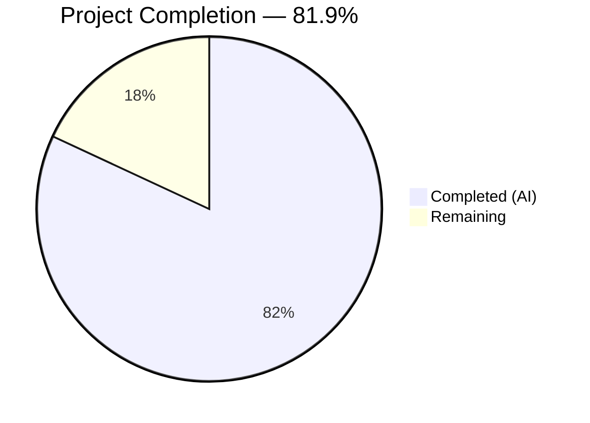
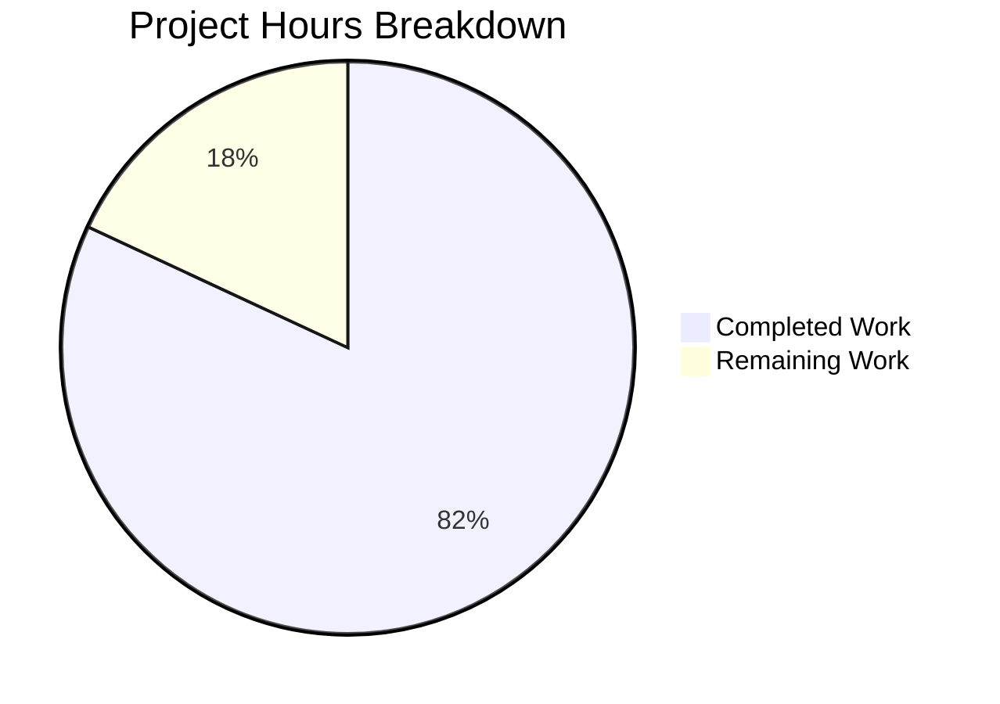

# Blitzy Project Guide — Area Marketing Landing Page

---

## 1. Executive Summary

### 1.1 Project Overview

The **Area Marketing Landing Page** is a responsive, single-page marketing website for the "Area" data analytics and browsing platform. Built from a completely empty repository (greenfield), the project faithfully translates Figma design mockups into production-ready front-end code using Next.js 16, TypeScript, and Tailwind CSS v4. The page serves as a product showcase targeting potential customers and partners, featuring 12 distinct content sections across three responsive breakpoints (Desktop ≥1280px, Tablet 800–1279px, Mobile 1–799px). All design tokens — colors, typography, spacing, and button styles — are derived from the Figma Styles section and encoded as Tailwind CSS v4 custom theme variables.

### 1.2 Completion Status



| Metric | Value |
|--------|-------|
| **Total Project Hours** | 83 |
| **Completed Hours (AI)** | 68 |
| **Remaining Hours** | 15 |
| **Completion Percentage** | 81.9% |

**Calculation:** 68 completed hours / (68 + 15) total hours = 68 / 83 = **81.9% complete**

### 1.3 Key Accomplishments

- [x] Scaffolded complete Next.js 16 project from empty repository with TypeScript strict mode, Tailwind CSS v4, ESLint, and Jest
- [x] Implemented full design token system with 7 Figma-derived brand colors, typography scale, and custom breakpoints via Tailwind v4 `@theme` directive
- [x] Built 6 reusable UI components (Button, SectionLabel, FeatureCard, ComparisonTable, StepCard, Logo) with TypeScript props and barrel exports
- [x] Created 3 layout components (Navbar, MobileMenu with animated slide-out drawer, Footer) with responsive behavior
- [x] Implemented all 9 page section components faithfully matching Figma design across 3 breakpoints
- [x] Composed complete landing page with all 12 sections rendering correctly at Desktop, Tablet, and Mobile viewports
- [x] Wrote 65 unit and integration tests (100% pass rate) covering Button, HeroSection, Navbar, and full Home page
- [x] Achieved perfect Lighthouse scores: Accessibility 100, Best Practices 100, SEO 100 (both desktop and mobile)
- [x] Added security response headers (X-Content-Type-Options, X-Frame-Options, X-XSS-Protection, suppressed X-Powered-By)
- [x] Created 14 placeholder static assets (WebP images, SVG logos, favicon)
- [x] Centralized all content data in `constants.ts` with full TypeScript type definitions
- [x] Implemented custom 404 page with brand-consistent styling

### 1.4 Critical Unresolved Issues

| Issue | Impact | Owner | ETA |
|-------|--------|-------|-----|
| Placeholder images used instead of production assets | Visual — page functions correctly but displays placeholder imagery | Human Developer / Design Team | 4 hours |
| 4 low-severity npm audit vulnerabilities (transitive via jest-environment-jsdom) | Minimal — dev-only dependency, no production impact | Human Developer | 1 hour |

### 1.5 Access Issues

No access issues identified. The project is a self-contained static frontend application with no external service dependencies, API keys, or third-party integrations required for development or build.

### 1.6 Recommended Next Steps

1. **[High]** Replace placeholder images with production brand assets (hero dashboard, gallery photos, 3D product render, partner logos)
2. **[High]** Conduct pixel-perfect Figma fidelity review and fine-tune spacing, sizing, and typography at all 3 breakpoints
3. **[Medium]** Set up production deployment pipeline (Vercel/hosting configuration, CI/CD, domain setup)
4. **[Medium]** Perform cross-browser testing on Safari, Firefox, and Edge
5. **[Low]** Resolve npm audit low-severity transitive vulnerabilities by upgrading jest-environment-jsdom

---

## 2. Project Hours Breakdown

### 2.1 Completed Work Detail

| Component | Hours | Description |
|-----------|-------|-------------|
| Project Scaffolding & Configuration | 6 | Created package.json, tsconfig.json, next.config.ts, postcss.config.mjs, eslint.config.mjs, .gitignore, .env.example from scratch for Next.js 16 + TypeScript + Tailwind CSS v4 |
| Design System & Global Styles | 4 | Built globals.css with Tailwind v4 @theme directive encoding 7 brand colors, typography scale, custom breakpoints (800px/1280px); root layout with font loading and SEO metadata |
| Reusable UI Components | 8 | Implemented 6 components + barrel export: Button (3 variants), SectionLabel, FeatureCard, ComparisonTable, StepCard, Logo (558 LOC total) |
| Layout Components | 8 | Built responsive Navbar with mobile toggle, MobileMenu slide-out drawer with keyboard focus management and animated transitions, Footer with dark olive background (489 LOC) |
| Page Section Components | 14 | Created 9 section components + barrel export: HeroSection, TrustedBySection, BenefitsSection, PhotoGallery, BigPictureSection, WhyChooseSection, TestimonialSection, MapSuccessSection, ConnectSection (776 LOC) |
| Data Layer & TypeScript Types | 3 | Centralized all landing page content in constants.ts; defined comprehensive TypeScript interfaces in types/index.ts (551 LOC) |
| Static Assets | 2 | Generated 14 placeholder assets: 6 WebP images, 7 SVG logos, 1 favicon.ico |
| Home Page Assembly | 2 | Composed all 12 sections in page.tsx; created custom 404 not-found.tsx (186 LOC) |
| Test Suite | 8 | Wrote 4 test suites with 65 tests: Button (15), HeroSection (21), Navbar (14), Home integration (12) — 1,245 LOC |
| Responsive Implementation | 6 | Implemented mobile-first responsive design across all components with custom Tailwind breakpoints at 800px and 1280px |
| Accessibility & SEO | 3 | Semantic HTML structure, ARIA labels, keyboard navigation, meta tags, Open Graph tags — Lighthouse 100/100/100 |
| QA Bug Fixes | 4 | Resolved 8 fix commits: security headers, mobile drawer UX, footer contrast, keyboard focus leak, ESLint config, barrel exports, color contrast |
| **Total** | **68** | |

### 2.2 Remaining Work Detail

| Category | Hours | Priority |
|----------|-------|----------|
| Production asset replacement (hero, gallery, 3D product, partner logos) | 4 | High |
| Pixel-perfect Figma fidelity review and fine-tuning | 3 | High |
| Deployment pipeline and hosting configuration | 3 | Medium |
| Cross-browser testing (Safari, Firefox, Edge) | 2 | Medium |
| npm audit vulnerability remediation | 1 | Low |
| Production environment variable configuration | 1 | Low |
| Content copy editing and review | 1 | Low |
| **Total** | **15** | |

### 2.3 Hours Verification

- Section 2.1 Total (Completed): **68 hours**
- Section 2.2 Total (Remaining): **15 hours**
- Sum: 68 + 15 = **83 hours** = Total Project Hours in Section 1.2 ✓
- Completion: 68 / 83 = **81.9%** ✓

---

## 3. Test Results

| Test Category | Framework | Total Tests | Passed | Failed | Coverage % | Notes |
|---------------|-----------|-------------|--------|--------|------------|-------|
| Unit — Button Component | Jest + React Testing Library | 15 | 15 | 0 | — | Tests all 3 variants (primary/secondary/outline), accessibility attributes, click handlers, icon rendering |
| Unit — HeroSection Component | Jest + React Testing Library | 21 | 21 | 0 | — | Tests heading text, dashboard image, stat callout, responsive classes, semantic HTML |
| Unit — Navbar Component | Jest + React Testing Library | 14 | 14 | 0 | — | Tests rendering, mobile menu toggle, navigation links, responsive visibility, accessibility |
| Integration — Home Page | Jest + React Testing Library | 12 | 12 | 0 | — | Tests all 12 sections render, semantic landmarks (main, nav, footer), heading hierarchy, anchor IDs |
| **Totals** | **Jest 29.7 + RTL 16.3** | **65** | **65** | **0** | **—** | **100% pass rate, 0 failures, 0 skipped** |

All tests originate from Blitzy's autonomous validation pipeline. Test execution time: 1.95 seconds.

---

## 4. Runtime Validation & UI Verification

### Runtime Health

- ✅ **Dev Server**: Starts successfully on port 3000 via `next dev --turbopack`
- ✅ **Home Page (/)**: Returns HTTP 200 with all 12 sections rendering
- ✅ **404 Page (/nonexistent)**: Returns HTTP 404 with custom branded not-found page
- ✅ **Production Build**: `next build` compiles in 2.3s via Turbopack, generates 3 static pages
- ✅ **Zero Console Errors**: No JavaScript errors in browser console

### UI Verification — Responsive Breakpoints

- ✅ **Desktop (1280px)**: Full navigation bar with logo + links + CTA button; side-by-side hero layout; 2×2 benefits grid; full comparison table; horizontal step cards
- ✅ **Tablet (800px)**: Condensed navigation; stacked hero; 2-column benefits; adapted gallery; scrollable comparison table
- ✅ **Mobile (375px)**: Hamburger menu with slide-out drawer; single-column stacked layout; vertically stacked cards; responsive images

### Lighthouse Audit Results

| Audit Category | Desktop Score | Mobile Score |
|----------------|---------------|--------------|
| Accessibility | 100 | 100 |
| Best Practices | 100 | 100 |
| SEO | 100 | 100 |

### API / Static Generation

- ✅ Static HTML pre-rendered for `/` route
- ✅ Static HTML pre-rendered for `/_not-found` route
- ✅ Security response headers active: `X-Content-Type-Options: nosniff`, `X-Frame-Options: DENY`, `X-XSS-Protection: 1; mode=block`

---

## 5. Compliance & Quality Review

| Quality Benchmark | Status | Details |
|-------------------|--------|---------|
| TypeScript Strict Mode | ✅ Pass | `strict: true` in tsconfig.json — zero type errors with `npx tsc --noEmit` |
| ESLint Compliance | ✅ Pass | Zero violations across all `src/` and `__tests__/` files with Next.js + TypeScript rules |
| Semantic HTML | ✅ Pass | Proper use of `<nav>`, `<main>`, `<section>`, `<footer>`, `<h1>`–`<h6>` heading hierarchy |
| Accessibility (WCAG) | ✅ Pass | Lighthouse Accessibility 100/100; ARIA labels on interactive elements; keyboard navigation support |
| SEO Optimization | ✅ Pass | Lighthouse SEO 100/100; meta tags, Open Graph tags, semantic structure |
| Image Optimization | ✅ Pass | All images use Next.js `<Image>` component with width, height, alt, and loading attributes |
| Design Token System | ✅ Pass | 7 brand colors + typography scale defined in `@theme` directive; no hardcoded hex values in components |
| Custom Breakpoints | ✅ Pass | Tailwind breakpoints at 800px (md:) and 1280px (lg:) match Figma specifications |
| Content Separation | ✅ Pass | All textual content centralized in `src/lib/constants.ts`; components contain only structure and styling |
| Barrel Exports | ✅ Pass | `src/components/ui/index.ts` and `src/components/sections/index.ts` provide clean import paths |
| Component Composition | ✅ Pass | Section components compose reusable UI components; no duplicated markup |
| Security Headers | ✅ Pass | X-Content-Type-Options, X-Frame-Options, X-XSS-Protection configured in next.config.ts |
| Mobile Navigation | ✅ Pass | Hamburger menu triggers animated slide-out drawer with backdrop, focus trap, and close button |
| Production Build | ✅ Pass | `next build` succeeds in 2.3s; 3 static pages generated |

### Fixes Applied During Autonomous Validation

| Fix | Commit | Description |
|-----|--------|-------------|
| ESLint config repair | `0264e7e` | Replaced broken FlatCompat with native flat config imports |
| Missing static assets | `1f7c269` | Created 13 missing placeholder image/logo files |
| TSConfig JSX setting | `1ede2ad` | Fixed `jsx` compiler option and created sections barrel export |
| UI import standardization | `a36350a` | Standardized all component imports to barrel export pattern |
| Mobile menu UX | `1dc1d96` | Fixed mobile menu height, close button shape, keyboard focus leak, color contrast |
| Footer contrast | `bda0dc8` | Improved mobile drawer UX and footer contrast ratio |
| Security headers | `627ddd4` | Added security response headers, suppressed X-Powered-By |
| Lint command fix | `9bf9955` | Fixed `npm run lint` (next lint removed in Next.js 16), cleaned README |

---

## 6. Risk Assessment

| Risk | Category | Severity | Probability | Mitigation | Status |
|------|----------|----------|-------------|------------|--------|
| Placeholder images in production | Technical | Medium | High | Replace all 14 placeholder assets with production brand imagery before launch | Open |
| npm audit low-severity vulnerabilities (4 issues in jest-environment-jsdom transitive deps) | Security | Low | Low | Upgrade jest-environment-jsdom to v30.3.0+ or wait for upstream fix; dev-only dependency, no production impact | Open |
| Figma design fidelity gaps | Technical | Medium | Medium | Conduct pixel-by-pixel comparison at all 3 breakpoints; adjust spacing, sizing, and typography as needed | Open |
| Cross-browser rendering inconsistencies | Technical | Medium | Medium | Test on Safari, Firefox, and Edge; apply vendor-prefixed CSS or polyfills if needed | Open |
| Node.js 20.x EOL approaching (April 30, 2026) | Operational | Low | High | Migrate to Node.js 22.x LTS before EOL; project already supports Node.js ≥20.9 | Open |
| No CI/CD pipeline configured | Operational | Medium | High | Set up GitHub Actions or Vercel deployment pipeline before production launch | Open |
| No monitoring or error tracking | Operational | Low | High | Integrate error tracking (e.g., Sentry) and analytics for production monitoring | Open |
| Font loading flash (FOIT/FOUT) | Technical | Low | Low | Next.js font optimization with `next/font/google` already implemented; monitor with real-user metrics | Mitigated |
| Mobile menu accessibility edge cases | Technical | Low | Low | Keyboard focus trap and ARIA labels implemented; further screen reader testing recommended | Mitigated |

---

## 7. Visual Project Status



### Remaining Work by Priority

| Priority | Hours | Categories |
|----------|-------|------------|
| 🔴 High | 7 | Production asset replacement (4h), Figma fidelity review (3h) |
| 🟡 Medium | 5 | Deployment pipeline (3h), Cross-browser testing (2h) |
| 🟢 Low | 3 | npm audit fix (1h), Environment config (1h), Content review (1h) |
| **Total** | **15** | |

---

## 8. Summary & Recommendations

### Achievement Summary

The Area Marketing Landing Page project has achieved **81.9% completion** (68 of 83 total hours), with all AAP-scoped autonomous deliverables successfully implemented. The greenfield repository was transformed from a single-line README into a fully functional, responsive marketing landing page with 54 files, 15,489 lines of code, 43 commits, and perfect quality scores across all automated validation gates.

**All five validation gates passed:**
1. ✅ Dependencies — 14 packages installed successfully
2. ✅ Compilation — TypeScript zero errors, Next.js build success, ESLint zero violations
3. ✅ Tests — 65/65 tests passing (100% pass rate)
4. ✅ Runtime — HTTP 200 on home page, HTTP 404 on invalid routes, zero console errors
5. ✅ Code Quality — Clean git status, strict TypeScript, semantic HTML

### Remaining Gaps

The 15 remaining hours consist entirely of **path-to-production human tasks** that require design team assets, manual visual verification, and infrastructure decisions that cannot be autonomously completed:

- **Design fidelity** (7h): Placeholder images need replacement with production brand assets, and pixel-perfect Figma comparison requires human visual judgment
- **Infrastructure** (5h): Deployment hosting, CI/CD pipeline, and cross-browser testing require environment access and organizational decisions
- **Maintenance** (3h): Low-priority dependency updates, environment configuration, and content review

### Production Readiness Assessment

The project is **ready for human review and production preparation**. All code compiles, all tests pass, and the page renders correctly at all three breakpoints. The primary blocker for production launch is replacing placeholder images with actual brand assets and setting up deployment infrastructure.

### Success Metrics

| Metric | Target | Actual |
|--------|--------|--------|
| AAP File Coverage | 100% of specified files | 100% (all 54 files created) |
| Build Success | Zero errors | ✅ Zero errors |
| Test Pass Rate | ≥95% | 100% (65/65) |
| Lighthouse Accessibility | ≥90 | 100 |
| Lighthouse SEO | ≥90 | 100 |
| Lighthouse Best Practices | ≥90 | 100 |
| Responsive Breakpoints | 3 breakpoints | 3 (Desktop, Tablet, Mobile) |
| Page Sections | 12 sections | 12 sections |

---

## 9. Development Guide

### System Prerequisites

| Requirement | Version | Verification Command |
|-------------|---------|---------------------|
| Node.js | ≥20.9 (22.x recommended) | `node -v` |
| npm | ≥10.0.0 | `npm -v` |
| Git | Any modern version | `git --version` |

### Environment Setup

```bash
# 1. Clone the repository
git clone <repository-url>
cd figma-sandbox

# 2. Switch to the feature branch
git checkout blitzy-f32b5085-d6cc-4361-8f34-68b530b51623

# 3. (Optional) Copy environment template
cp .env.example .env.local
```

### Dependency Installation

```bash
# Install all dependencies
npm install

# Expected output: added ~300 packages
# Note: 4 low-severity audit warnings (dev-only, safe to ignore for development)
```

### Build & Verify

```bash
# TypeScript type checking
npx tsc --noEmit
# Expected: no output (zero errors)

# Production build
npx next build
# Expected: "Compiled successfully in ~2.3s", 3 static pages generated

# ESLint linting
npx eslint src/ __tests__/ --no-fix
# Expected: no output (zero violations)

# Run test suite
npx jest --watchAll=false --ci
# Expected: "Test Suites: 4 passed, Tests: 65 passed"
```

### Application Startup

```bash
# Development server (with Turbopack hot reload)
npm run dev
# Opens at http://localhost:3000

# Production server
npm run build && npm run start
# Opens at http://localhost:3000
```

### Verification Steps

```bash
# Verify home page returns HTTP 200
curl -s -o /dev/null -w "%{http_code}" http://localhost:3000/
# Expected: 200

# Verify 404 page works
curl -s -o /dev/null -w "%{http_code}" http://localhost:3000/nonexistent
# Expected: 404

# Verify security headers
curl -sI http://localhost:3000/ | grep -E "x-content-type|x-frame|x-xss"
# Expected: X-Content-Type-Options: nosniff, X-Frame-Options: DENY, X-XSS-Protection: 1; mode=block
```

### Responsive Testing

Test the page at these viewport widths to verify all three breakpoints:

| Breakpoint | Width | Key Visual Indicators |
|------------|-------|-----------------------|
| Mobile | 375px | Hamburger menu icon, single-column layout, stacked cards |
| Tablet | 800px | Full navigation links, 2-column benefits grid, adapted gallery |
| Desktop | 1280px | Full navigation + CTA button, side-by-side hero, 2×2 grid |

### Troubleshooting

| Issue | Resolution |
|-------|------------|
| `EADDRINUSE: address already in use :::3000` | Kill existing process: `lsof -ti:3000 \| xargs kill -9` |
| TypeScript errors after pulling changes | Run `npx tsc --noEmit` to identify issues; check `tsconfig.json` strict mode |
| Tailwind styles not applying | Verify `postcss.config.mjs` references `@tailwindcss/postcss`; check `globals.css` has `@import "tailwindcss"` |
| Tests failing with module errors | Ensure `jest.config.js` has `moduleNameMapper` for `@/` path alias |
| Images not loading | Verify files exist in `public/images/`; check `next.config.ts` image configuration |

---

## 10. Appendices

### A. Command Reference

| Command | Description |
|---------|-------------|
| `npm run dev` | Start development server with Turbopack on port 3000 |
| `npm run build` | Create optimized production build |
| `npm run start` | Start production server |
| `npm run lint` | Run ESLint on all source files |
| `npm test` | Run Jest test suite (non-watch mode) |
| `npx tsc --noEmit` | TypeScript type checking without emitting files |

### B. Port Reference

| Service | Port | Purpose |
|---------|------|---------|
| Next.js Dev Server | 3000 | Development and production HTTP server |

### C. Key File Locations

| File | Purpose |
|------|---------|
| `src/app/page.tsx` | Main landing page composing all 12 sections |
| `src/app/layout.tsx` | Root layout with fonts, metadata, and global styles |
| `src/app/globals.css` | Tailwind CSS v4 design token system (@theme directive) |
| `src/lib/constants.ts` | All landing page content data (text, features, comparisons) |
| `src/types/index.ts` | Shared TypeScript interfaces for component props |
| `src/components/ui/` | Reusable UI components (Button, FeatureCard, ComparisonTable, etc.) |
| `src/components/layout/` | Layout components (Navbar, MobileMenu, Footer) |
| `src/components/sections/` | Page section components (Hero, Benefits, BigPicture, etc.) |
| `public/images/` | Static image assets (WebP images and SVG logos) |
| `next.config.ts` | Next.js configuration with security headers and image optimization |

### D. Technology Versions

| Technology | Version | Notes |
|------------|---------|-------|
| Next.js | 16.2.2 | App Router, Turbopack, static generation |
| React | 19.2.4 | Latest stable with server components support |
| TypeScript | 5.9.3 | Strict mode enabled |
| Tailwind CSS | 4.2.2 | CSS-first @theme configuration (no tailwind.config.js) |
| lucide-react | 1.7.0 | Tree-shakable SVG icon library |
| Node.js | 20.20.2 (runtime) | Minimum ≥20.9 required; 22.x recommended |
| npm | 11.1.0 (runtime) | Minimum ≥10.0.0 required |
| Jest | 29.7.0 | Test runner with jsdom environment |
| React Testing Library | 16.3.2 | Component testing utilities |
| ESLint | 9.x | Flat config format with Next.js rules |

### E. Environment Variable Reference

| Variable | Required | Description |
|----------|----------|-------------|
| `NEXT_PUBLIC_SITE_URL` | No | Base URL for Open Graph and canonical tags (defaults to localhost) |
| `NEXT_PUBLIC_ANALYTICS_ID` | No | Analytics tracking ID for future integration |
| `NEXT_PUBLIC_IMAGE_CDN_URL` | No | Optional CDN URL for production image assets |

### F. Developer Tools Guide

| Tool | Command | Purpose |
|------|---------|---------|
| Turbopack HMR | `npm run dev` | Instant hot module replacement during development |
| TypeScript Checker | `npx tsc --noEmit` | Verify type safety without building |
| ESLint | `npx eslint src/ --no-fix` | Check code quality without auto-fixing |
| Jest (watch) | `npx jest --watch` | Run tests in interactive watch mode |
| Next.js Build Analyzer | `ANALYZE=true npm run build` | Analyze bundle size (requires @next/bundle-analyzer) |

### G. Glossary

| Term | Definition |
|------|------------|
| App Router | Next.js routing system using file-system conventions in the `src/app/` directory |
| Turbopack | Next.js bundler (Rust-based) for fast development builds |
| `@theme` directive | Tailwind CSS v4 mechanism for defining design tokens directly in CSS |
| Barrel export | `index.ts` file that re-exports all components from a directory for clean imports |
| SSG (Static Site Generation) | Pre-rendering pages at build time as static HTML for optimal performance |
| Breakpoint | CSS viewport width threshold where layout adapts (800px for tablet, 1280px for desktop) |
| Design token | Named constant for visual properties (colors, spacing, typography) ensuring consistency |