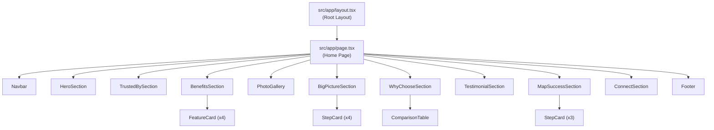

# Technical Specification

# 0. Agent Action Plan

## 0.1 Intent Clarification

### 0.1.1 Core Feature Objective

Based on the prompt, the Blitzy platform understands that the new feature requirement is to **build a complete marketing landing page called "Area"** from scratch in an empty repository (`figma-sandbox`), faithfully translating Figma design screenshots provided in a PDF attachment into production-ready front-end code.

The specific requirements are:

- **Build a responsive marketing landing page** named "Area" that serves as a product showcase for a data analytics / browsing platform
- **Implement three responsive breakpoints** derived from the Figma design:
  - **Desktop** layout at 1280px and above
  - **Tablet** layout between 800px and 1279px
  - **Mobile** layout between 1px and 799px
- **Apply the Styles section** from the PDF as the single source of truth for all design tokens including colors, typography, button styles, icons, and spacing
- **Translate all page sections** visible in the "Types of Home Screens" Figma screenshots into functioning UI components, including:
  - Navigation bar with responsive hamburger menu for mobile
  - Hero section with "Browse everything." headline and dashboard mockup
  - "Trusted by" partner logo bar
  - Benefits section with four feature cards
  - Photo gallery section
  - "See the Big Picture" section with numbered steps
  - "Why Choose Area?" comparison table
  - Testimonial section
  - "Map Your Success" three-step section
  - Full-width landscape image
  - "Connect with us" call-to-action section
  - Footer with navigation links and copyright

**Implicit requirements detected:**

- Since the repository is completely empty (contains only `README.md` with `# figma-sandbox`), the entire project must be scaffolded from scratch including framework setup, build tooling, dependency installation, and folder structure
- Responsive design must use CSS media queries / breakpoint utilities rather than separate routes per breakpoint, as the three "screens" represent the same page at different viewport widths
- All placeholder images (dashboard mockup, landscape photos, 3D cylinder product renders, partner logos) must be handled via appropriate placeholder assets or Next.js Image components with fallback patterns
- Accessibility requirements are implicit: semantic HTML, proper heading hierarchy, ARIA labels for interactive elements, keyboard navigation support, and sufficient color contrast
- SEO considerations for a marketing landing page: meta tags, Open Graph tags, structured markup, and performant asset loading

### 0.1.2 Special Instructions and Constraints

- **Design fidelity**: The Styles section of the PDF is the authoritative reference for all visual properties — colors, typography scales, button styles, icon choices, and spacing values must be extracted from these screenshots and applied consistently across all breakpoints
- **Greenfield project**: No existing code, framework, or dependencies exist — every file must be created from scratch
- **Responsive-first architecture**: While the user described three "screens" as "separate page/route," the standard and recommended approach for a marketing landing page is a single responsive page with CSS breakpoints matching Desktop (≥1280px), Tablet (800–1279px), and Mobile (1–799px)
- **No external design system library specified**: The user has not specified any third-party component library (e.g., Material UI, Ant Design, Shadcn/ui) — all UI components will be custom-built using Tailwind CSS utility classes, matching the visual language from the Figma PDF

User Example (breakpoint specification): "Desktop (1280px+), Tablet (800–1279px), Mobile (1–799px)"

### 0.1.3 Technical Interpretation

These feature requirements translate to the following technical implementation strategy:

- To **scaffold the project**, we will create a new Next.js application with TypeScript and Tailwind CSS configured out of the box, using the App Router pattern for modern React server component support and static site generation capabilities ideal for marketing pages
- To **implement the responsive layout**, we will create a single route (`/`) containing all page sections as composable React components, with Tailwind CSS responsive prefixes (`md:`, `lg:`, custom breakpoints) mapping to the three design breakpoints
- To **implement the design system**, we will extract all design tokens (colors, typography, spacing, border radii) from the Figma PDF Styles section and encode them as Tailwind CSS custom theme variables using the `@theme` directive in `globals.css`
- To **build the page sections**, we will create individual React components for each visual section (Hero, Benefits, Comparison Table, etc.) composed within the main page component
- To **handle icons**, we will use the `lucide-react` icon library which provides the closest matches to the icons visible in the Figma Styles section (gear, check, close, chart, grid, eye, building, location)
- To **manage images**, we will use Next.js `Image` component with placeholder blur-up for optimized loading, with actual image assets stored in the `public/images/` directory
- To **ensure mobile navigation**, we will build a hamburger menu component with a slide-out drawer overlay as shown in the Figma mobile navigation variant

## 0.2 Repository Scope Discovery

### 0.2.1 Comprehensive File Analysis

**Current repository state:** The `figma-sandbox` repository is entirely empty — it contains a single `README.md` file with only the heading `# figma-sandbox`. There are no frameworks, dependencies, configuration files, build pipelines, or source code present. Every file listed below must be created from scratch.

**Repository root contents discovered:**

| Path | Type | Status |
|------|------|--------|
| `README.md` | File | Exists (single line: `# figma-sandbox`) |
| `.git/` | Directory | Exists (git initialized) |

**Existing modules to modify:**

| File | Modification Required |
|------|----------------------|
| `README.md` | Rewrite with project description, setup instructions, tech stack documentation, and development guide |

**Integration point discovery:**

Since this is a greenfield project, there are no existing API endpoints, database models, service classes, controllers, or middleware to integrate with. All integration points are **new creation** items documented in the New File Requirements section below.

### 0.2.2 New File Requirements

**Project Configuration Files (root):**

| File | Purpose |
|------|---------|
| `package.json` | Project manifest with dependencies, scripts, and metadata |
| `tsconfig.json` | TypeScript compiler configuration for Next.js App Router |
| `next.config.ts` | Next.js framework configuration (image domains, static export settings) |
| `postcss.config.mjs` | PostCSS configuration for Tailwind CSS v4 integration |
| `.gitignore` | Git ignore rules for `node_modules/`, `.next/`, build artifacts |
| `.env.example` | Environment variable template (if needed for image CDN or analytics) |
| `eslint.config.mjs` | ESLint flat config for Next.js + TypeScript linting |

**Application Source Files (`src/app/`):**

| File | Purpose |
|------|---------|
| `src/app/layout.tsx` | Root layout with HTML structure, font loading, metadata, global styles |
| `src/app/page.tsx` | Home page composing all landing page sections in order |
| `src/app/globals.css` | Tailwind CSS imports, `@theme` design token definitions, custom utilities |
| `src/app/not-found.tsx` | Custom 404 page |

**Layout Components (`src/components/layout/`):**

| File | Purpose |
|------|---------|
| `src/components/layout/Navbar.tsx` | Top navigation bar with logo, links, and responsive hamburger toggle |
| `src/components/layout/MobileMenu.tsx` | Slide-out mobile drawer menu overlay with animated transitions |
| `src/components/layout/Footer.tsx` | Footer with logo, navigation links, and copyright notice |

**Page Section Components (`src/components/sections/`):**

| File | Purpose |
|------|---------|
| `src/components/sections/HeroSection.tsx` | Hero banner with "Browse everything." headline and dashboard mockup image |
| `src/components/sections/TrustedBySection.tsx` | Partner logo bar with "Trusted by:" label and horizontal logo row |
| `src/components/sections/BenefitsSection.tsx` | Benefits grid with "We've cracked the code." heading and four feature cards |
| `src/components/sections/PhotoGallery.tsx` | Full-width and multi-image gallery section with landscape photographs |
| `src/components/sections/BigPictureSection.tsx` | "See the Big Picture" section with four numbered insight steps and product image |
| `src/components/sections/WhyChooseSection.tsx` | "Why Choose Area?" section with description and competitor comparison table |
| `src/components/sections/TestimonialSection.tsx` | Customer testimonial quote with attribution |
| `src/components/sections/MapSuccessSection.tsx` | "Map Your Success" three-step process section |
| `src/components/sections/ConnectSection.tsx` | "Connect with us" call-to-action section with wide CTA button |
| `src/components/sections/index.ts` | Barrel export for all section components |

**Reusable UI Components (`src/components/ui/`):**

| File | Purpose |
|------|---------|
| `src/components/ui/Button.tsx` | Pill-shaped button component with primary/secondary/outline variants |
| `src/components/ui/SectionLabel.tsx` | Small uppercase section label component (e.g., "Benefits", "More") |
| `src/components/ui/FeatureCard.tsx` | Feature card with icon, title, and description for Benefits grid |
| `src/components/ui/ComparisonTable.tsx` | Feature comparison table (Area vs WebSurge vs HyperView) with check/cross marks |
| `src/components/ui/StepCard.tsx` | Numbered step card for "See the Big Picture" and "Map Your Success" sections |
| `src/components/ui/Logo.tsx` | Area brand logo component (stylized human figure + "Area" text) |
| `src/components/ui/index.ts` | Barrel export for all UI components |

**Shared Utilities and Types:**

| File | Purpose |
|------|---------|
| `src/lib/constants.ts` | Landing page content data (text, feature lists, comparison data, testimonials) |
| `src/types/index.ts` | Shared TypeScript interfaces for component props, content data structures |

**Static Assets (`public/`):**

| Directory / File | Purpose |
|------------------|---------|
| `public/images/hero-dashboard.webp` | Hero section dashboard mockup image |
| `public/images/gallery-1.webp` | Landscape photo for gallery section |
| `public/images/gallery-2.webp` | Landscape photo for gallery section |
| `public/images/gallery-3.webp` | Landscape photo for gallery section |
| `public/images/3d-product.webp` | 3D cylinder product render for "See the Big Picture" section |
| `public/images/aerial-landscape.webp` | Full-width aerial photograph |
| `public/images/logos/area-logo.svg` | Area brand logo SVG |
| `public/images/logos/partner-*.svg` | Partner/client placeholder logos (Logoipsum-style) |
| `public/favicon.ico` | Browser favicon |

**Test Files:**

| File | Purpose |
|------|---------|
| `__tests__/components/Navbar.test.tsx` | Unit tests for Navbar rendering and mobile toggle behavior |
| `__tests__/components/HeroSection.test.tsx` | Unit tests for Hero section rendering |
| `__tests__/components/Button.test.tsx` | Unit tests for Button variants and accessibility |
| `__tests__/pages/Home.test.tsx` | Integration test for complete home page composition |

### 0.2.3 Web Search Research Conducted

The following research was conducted to validate technology choices and identify current best practices:

- **Next.js latest stable version**: Confirmed v16.2.2 (released April 2, 2026) as the latest stable release with App Router, Turbopack, TypeScript, and Tailwind CSS enabled by default
- **Tailwind CSS latest stable version**: Confirmed v4.2.2 (released March 18, 2026) with CSS-first `@theme` configuration, automatic content detection, and zero-config setup
- **TypeScript latest stable version**: Confirmed TypeScript 6.0 (released March 23, 2026) as a bridge release; TypeScript 5.9.2 recommended for proven stability in production
- **Node.js LTS status**: Node.js 20.x in Maintenance LTS (EOL April 30, 2026); Node.js 22.x in Maintenance LTS (EOL April 30, 2027); Node.js 24.x in Active LTS (recommended for new projects)
- **Icon library**: Confirmed lucide-react v1.7.0 as the latest stable release with 1000+ tree-shakable React icon components
- **Responsive landing page patterns**: CSS media queries with Tailwind breakpoint prefixes as industry standard for multi-viewport marketing sites

## 0.3 Dependency Inventory

### 0.3.1 Private and Public Packages

Since this is a greenfield project with no existing `package.json`, all dependencies listed below must be installed as new additions. Versions have been verified against the latest stable releases as of April 2026.

**Production Dependencies:**

| Registry | Package | Version | Purpose |
|----------|---------|---------|---------|
| npm | `next` | `16.2.2` | React framework with App Router, SSG, image optimization, and Turbopack |
| npm | `react` | `^19.0.0` | UI component library (peer dependency of Next.js 16) |
| npm | `react-dom` | `^19.0.0` | React DOM renderer (peer dependency of Next.js 16) |
| npm | `lucide-react` | `^1.7.0` | Tree-shakable SVG icon library matching Figma design icons |

**Development Dependencies:**

| Registry | Package | Version | Purpose |
|----------|---------|---------|---------|
| npm | `typescript` | `^5.9.2` | Static type checking for TypeScript source files |
| npm | `@types/react` | `^19.0.0` | TypeScript type definitions for React 19 |
| npm | `@types/react-dom` | `^19.0.0` | TypeScript type definitions for React DOM 19 |
| npm | `@types/node` | `^22.0.0` | TypeScript type definitions for Node.js APIs |
| npm | `tailwindcss` | `^4.2.2` | Utility-first CSS framework for responsive styling |
| npm | `@tailwindcss/postcss` | `^4.2.2` | PostCSS plugin for Tailwind CSS v4 integration with Next.js |
| npm | `eslint` | `^9.0.0` | JavaScript/TypeScript linter |
| npm | `eslint-config-next` | `16.2.2` | Next.js-specific ESLint configuration and rules |

**Runtime Environment:**

| Component | Version | Justification |
|-----------|---------|---------------|
| Node.js | `>=20.9` (22.x recommended) | Minimum required by Next.js 16.2.2; Node.js 22.x recommended for new projects due to Node.js 20 EOL on April 30, 2026 |
| npm | `>=10.0.0` | Package manager bundled with Node.js; v11.1.0 available with Node.js 20.20.2 |

### 0.3.2 Dependency Updates

Since the repository is empty and this is a greenfield project, there are no existing imports, external references, or build files to update. All dependencies will be fresh installations.

**Import patterns to establish across new files:**

- Framework imports:
  - `import Image from 'next/image'`
  - `import Link from 'next/link'`
  - `import type { Metadata } from 'next'`
- React imports:
  - `import { useState, useCallback } from 'react'`
- Icon imports (tree-shaken individual icons):
  - `import { Settings, Check, X, TrendingUp, LayoutGrid, Eye, Building, MapPin, Menu, ChevronRight, ArrowRight } from 'lucide-react'`
- Internal imports using `@/` alias:
  - `import { Button } from '@/components/ui'`
  - `import { HeroSection, BenefitsSection } from '@/components/sections'`
  - `import { SITE_CONTENT } from '@/lib/constants'`
  - `import type { FeatureCardProps } from '@/types'`

**Configuration file references to create:**

| File | Reference/Import |
|------|-----------------|
| `postcss.config.mjs` | `@tailwindcss/postcss` plugin registration |
| `tsconfig.json` | Path alias `@/*` mapping to `./src/*` |
| `next.config.ts` | Image optimization configuration, static export settings |
| `src/app/globals.css` | `@import "tailwindcss"` and `@theme` design token definitions |

## 0.4 Integration Analysis

### 0.4.1 Existing Code Touchpoints

Since the repository contains only a single `README.md` file, there is exactly one existing file requiring modification:

- **`README.md`**: Replace the placeholder content (`# figma-sandbox`) with comprehensive project documentation including project overview, technology stack, setup instructions, development workflow, build commands, and deployment guide

All other touchpoints are **new creation items** — there are no existing modules, services, APIs, database schemas, or middleware to integrate with.

### 0.4.2 New Integration Points

The following integration points must be established as part of the greenfield project setup:

**Framework Integration:**

- **Next.js App Router ↔ React Components**: The root layout (`src/app/layout.tsx`) serves as the application shell, wrapping all pages with global HTML structure, font loading, and metadata. The home page (`src/app/page.tsx`) composes all section components in sequential order.
- **Next.js ↔ Tailwind CSS v4**: Integration through PostCSS pipeline — `postcss.config.mjs` registers `@tailwindcss/postcss`, and `src/app/globals.css` imports Tailwind via `@import "tailwindcss"` with custom design tokens defined in `@theme` blocks.
- **Next.js ↔ TypeScript**: `tsconfig.json` configures strict mode, JSX preservation, module resolution, and the `@/*` path alias for clean imports.
- **Next.js Image Optimization ↔ Static Assets**: `next.config.ts` configures image optimization settings; all static images are served from `public/images/` and referenced via `<Image src="/images/..." />`.

**Component Composition Chain:**

**Shared State and Data Flow:**

- **Content Data** (`src/lib/constants.ts`): All textual content, feature lists, comparison data, and testimonial quotes are centralized in a single constants file and imported by individual section components. This pattern separates content from presentation and simplifies future content updates.
- **Design Tokens** (`src/app/globals.css`): All color values, spacing scales, typography definitions, and border radii from the Figma Styles section are defined as CSS custom properties within the `@theme` directive, making them available across all Tailwind utility classes.
- **Component Props** (`src/types/index.ts`): Shared TypeScript interfaces define the prop contracts for reusable components (Button variants, FeatureCard data, StepCard data), ensuring type safety across the component tree.

**Responsive Breakpoint Integration:**

| Breakpoint | Width Range | Tailwind Prefix | CSS Media Query |
|------------|-------------|-----------------|-----------------|
| Mobile (default) | 1px – 799px | _(no prefix)_ | Default mobile-first styles |
| Tablet | 800px – 1279px | `md:` (custom at 800px) | `@media (min-width: 800px)` |
| Desktop | 1280px+ | `lg:` (custom at 1280px) | `@media (min-width: 1280px)` |

Custom breakpoints will be defined in `globals.css` using Tailwind v4's `@theme` directive to match the exact Figma specifications rather than Tailwind's default breakpoints.

## 0.5 Technical Implementation

### 0.5.1 File-by-File Execution Plan

Every file listed below MUST be created or modified. Files are organized into logical groups reflecting the implementation sequence.

**Group 1 — Project Scaffolding and Configuration:**

| Action | File | Implementation Details |
|--------|------|----------------------|
| CREATE | `package.json` | Define project name (`area-landing`), scripts (`dev`, `build`, `start`, `lint`), all production and dev dependencies with pinned versions |
| CREATE | `tsconfig.json` | Configure `strict: true`, `jsx: "preserve"`, `moduleResolution: "bundler"`, `paths: { "@/*": ["./src/*"] }`, include/exclude patterns |
| CREATE | `next.config.ts` | Configure image optimization, static export settings if needed, and any custom webpack/turbopack settings |
| CREATE | `postcss.config.mjs` | Register `@tailwindcss/postcss` plugin for Tailwind v4 integration |
| CREATE | `eslint.config.mjs` | Extend `eslint-config-next` with flat config format for TypeScript and React linting |
| CREATE | `.gitignore` | Standard Next.js ignores: `node_modules/`, `.next/`, `out/`, `.env*.local`, `*.tsbuildinfo` |
| CREATE | `.env.example` | Template for any future environment variables (e.g., analytics ID, image CDN URL) |
| MODIFY | `README.md` | Rewrite with project overview, tech stack, setup instructions, available scripts, project structure, and design reference notes |

**Group 2 — Design System and Global Styles:**

| Action | File | Implementation Details |
|--------|------|----------------------|
| CREATE | `src/app/globals.css` | Import Tailwind CSS (`@import "tailwindcss"`), define `@theme` block with all design tokens extracted from Figma Styles: custom color palette, typography scale, spacing values, border radii, custom breakpoints at 800px and 1280px |
| CREATE | `src/app/layout.tsx` | Root HTML layout with `<html lang="en">`, font loading (serif display font for headings, sans-serif for body), global `<Metadata>` object with title, description, and Open Graph tags, import of `globals.css` |

**Group 3 — Reusable UI Components:**

| Action | File | Implementation Details |
|--------|------|----------------------|
| CREATE | `src/components/ui/Button.tsx` | Pill-shaped button component with `variant` prop (`primary`, `secondary`, `outline`), optional `icon` slot, responsive sizing, hover/focus states matching Figma button styles |
| CREATE | `src/components/ui/SectionLabel.tsx` | Small uppercase label component used above section headings (e.g., "Benefits", "More", "Understand the Data") |
| CREATE | `src/components/ui/FeatureCard.tsx` | Card component accepting `icon`, `title`, and `description` props for the Benefits grid |
| CREATE | `src/components/ui/ComparisonTable.tsx` | Responsive comparison table with check/cross marks for Area vs WebSurge vs HyperView features |
| CREATE | `src/components/ui/StepCard.tsx` | Numbered step component with step number, title, and description for "See the Big Picture" and "Map Your Success" sections |
| CREATE | `src/components/ui/Logo.tsx` | Area brand logo component rendering the stylized human figure icon alongside "Area" text |
| CREATE | `src/components/ui/index.ts` | Barrel export file re-exporting all UI components |

**Group 4 — Layout Components:**

| Action | File | Implementation Details |
|--------|------|----------------------|
| CREATE | `src/components/layout/Navbar.tsx` | Responsive navigation bar: desktop shows logo + nav links (Benefits, Specifications, How-to, Contact Us) + CTA button; tablet condenses layout; mobile shows logo + hamburger icon triggering MobileMenu |
| CREATE | `src/components/layout/MobileMenu.tsx` | Full-screen slide-out drawer with backdrop overlay, animated entrance/exit, nav links list, close button, and "Learn More" CTA |
| CREATE | `src/components/layout/Footer.tsx` | Footer with Area logo, navigation links row, and copyright text "© Area · 2025 · All Rights Reserved" |

**Group 5 — Page Section Components:**

| Action | File | Implementation Details |
|--------|------|----------------------|
| CREATE | `src/components/sections/HeroSection.tsx` | Full-width hero with "Browse everything." display heading, descriptive subtext, dashboard mockup image, and stat callout ("78% Efficiency Improvements") with olive/sage background treatment |
| CREATE | `src/components/sections/TrustedBySection.tsx` | Horizontal scroll or flex row of partner logos with "Trusted by:" label, responsive wrapping on smaller viewports |
| CREATE | `src/components/sections/BenefitsSection.tsx` | Section with "Benefits" label, "We've cracked the code." heading, body text, and 2×2 grid (desktop) / stacked (mobile) FeatureCard layout for: Amplify Insights, Control Your Global Presence, Remove Language Barriers, Visualize Growth |
| CREATE | `src/components/sections/PhotoGallery.tsx` | Full-width and multi-photo gallery section displaying landscape photographs with responsive image sizing |
| CREATE | `src/components/sections/BigPictureSection.tsx` | "See the Big Picture" section with heading, description, four numbered StepCards (Spot Trends in Seconds, Get Everyone on the Same Page, Make Presentations Pop, Your Global Snapshot), "Discover More" CTA button, and 3D product image |
| CREATE | `src/components/sections/WhyChooseSection.tsx` | "Why Choose Area?" section with "More" label, heading, description, "Discover More" button, and ComparisonTable comparing Area/WebSurge/HyperView across features (Ultra-fast browsing, Advanced AI insights, Seamless integration, etc.) |
| CREATE | `src/components/sections/TestimonialSection.tsx` | Large testimonial quote block with customer quote text and attribution (name, title) |
| CREATE | `src/components/sections/MapSuccessSection.tsx` | "Map Your Success" heading, "Discover More" CTA, and three numbered StepCards: Get Started, Customize and Configure, Grow Your Business |
| CREATE | `src/components/sections/ConnectSection.tsx` | "Connect with us" heading, descriptive text, and wide pill-shaped "Learn More" CTA button |
| CREATE | `src/components/sections/index.ts` | Barrel export file for all section components |

**Group 6 — Data, Types, and Content:**

| Action | File | Implementation Details |
|--------|------|----------------------|
| CREATE | `src/lib/constants.ts` | Centralized content data: navigation links array, hero text, trusted-by logo list, benefits feature cards data, comparison table data (features × products × check/cross), testimonial text, step cards content, footer links, and meta content |
| CREATE | `src/types/index.ts` | TypeScript interfaces: `ButtonProps`, `FeatureCardData`, `ComparisonFeature`, `StepCardData`, `TestimonialData`, `NavLink`, `SiteContent` |

**Group 7 — Static Assets:**

| Action | File | Implementation Details |
|--------|------|----------------------|
| CREATE | `public/images/hero-dashboard.webp` | Placeholder or representative dashboard mockup image for hero section |
| CREATE | `public/images/gallery-*.webp` | Placeholder landscape photographs (3 images) |
| CREATE | `public/images/3d-product.webp` | Placeholder 3D cylinder product render |
| CREATE | `public/images/aerial-landscape.webp` | Placeholder aerial landscape photograph |
| CREATE | `public/images/logos/area-logo.svg` | Area brand logo SVG with stylized human figure |
| CREATE | `public/images/logos/partner-*.svg` | 5–6 placeholder partner logo SVGs |
| CREATE | `public/favicon.ico` | Area brand favicon |

**Group 8 — Home Page Assembly:**

| Action | File | Implementation Details |
|--------|------|----------------------|
| CREATE | `src/app/page.tsx` | Main home page composing all sections: `<Navbar />`, `<HeroSection />`, `<TrustedBySection />`, `<BenefitsSection />`, `<PhotoGallery />`, `<BigPictureSection />`, `<WhyChooseSection />`, `<TestimonialSection />`, `<MapSuccessSection />`, `<ConnectSection />`, `<Footer />` in order |
| CREATE | `src/app/not-found.tsx` | Custom 404 page with navigation back to home |

**Group 9 — Tests:**

| Action | File | Implementation Details |
|--------|------|----------------------|
| CREATE | `__tests__/components/Navbar.test.tsx` | Test Navbar rendering, link presence, mobile menu toggle state |
| CREATE | `__tests__/components/HeroSection.test.tsx` | Test hero heading text, image rendering, responsive class application |
| CREATE | `__tests__/components/Button.test.tsx` | Test all button variants render correctly, accessibility attributes present |
| CREATE | `__tests__/pages/Home.test.tsx` | Integration test verifying all sections render on the home page |

### 0.5.2 Implementation Approach

The implementation follows a bottom-up composition strategy:

- **Establish the foundation** by creating configuration files (`package.json`, `tsconfig.json`, `next.config.ts`, `postcss.config.mjs`) and the design token system (`globals.css` with `@theme`)
- **Build atomic UI components** (`Button`, `SectionLabel`, `FeatureCard`, `StepCard`, `ComparisonTable`, `Logo`) as self-contained, reusable building blocks
- **Compose layout components** (`Navbar`, `MobileMenu`, `Footer`) that provide the page shell and navigation framework
- **Assemble section components** (Hero, Benefits, BigPicture, WhyChoose, etc.) using the atomic UI components and content data from `constants.ts`
- **Wire the page together** in `src/app/page.tsx` by importing and composing all section components in the correct visual order
- **Validate quality** through unit tests for critical components and visual verification across all three breakpoints

### 0.5.3 User Interface Design

**Design Token System (extracted from Figma Styles section):**

The Figma PDF Styles section defines the following design tokens that will be encoded as Tailwind CSS theme variables:

**Color Palette:**

| Token Name | Approximate Value | Usage |
|------------|-------------------|-------|
| `--color-area-black` | Near-black (#1A1A1A) | Primary text, headings |
| `--color-area-olive` | Dark olive (#5A5C32) | Primary brand color, button backgrounds |
| `--color-area-gray` | Warm gray (#A8A89A) | Secondary text, borders |
| `--color-area-cream` | Off-white (#FAFAF5) | Page backgrounds, card surfaces |
| `--color-area-sage-light` | Pale sage (#D4D4A5) | Accent backgrounds, highlight areas |
| `--color-area-sage` | Sage green (#8B8F5E) | Secondary brand color, hover states |
| `--color-area-olive-dark` | Deep olive (#3D4A20) | Dark accents, footer backgrounds |

**Typography Scale:**

| Style | Role | Properties |
|-------|------|------------|
| Header | Page hero headlines | Large serif/display font, bold weight, tight tracking |
| Subheading 1 | Section headings | Medium-large serif font, regular weight |
| Subheading 2 | Sub-section headings | Medium serif font, bold weight |
| Key Point | Feature card titles, emphasis text | Small-medium sans-serif, bold weight |
| Body | Paragraph text, descriptions | Small sans-serif, regular weight, relaxed line-height |
| Label | Section labels, metadata | Extra-small sans-serif, uppercase, regular weight |
| UI Text | Button text, navigation links | Small sans-serif, medium/bold weight |

**Button Styles:**

| Variant | Background | Text | Border | Shape |
|---------|------------|------|--------|-------|
| Primary | Olive green | White | None | Pill (full rounded) |
| Secondary | Transparent | Olive green | 1px olive green | Pill (full rounded) |
| CTA Wide | Olive green | White | None | Pill, wider padding |
| Icon-only | Transparent | Olive green | 1px olive | Circle |

**Icon Mapping (Figma → lucide-react):**

| Figma Icon | lucide-react Component | Usage Context |
|------------|----------------------|---------------|
| Gear/settings | `Settings` | Feature card icon |
| Checkmark | `Check` | Comparison table positive |
| Close/X | `X` | Comparison table negative, mobile menu close |
| Chart/trending | `TrendingUp` | Feature card icon (Amplify Insights) |
| Grid/equalizer | `LayoutGrid` | Feature card icon |
| Eye | `Eye` | Feature card icon (Visualize Growth) |
| Building | `Building` | Feature card icon (Global Presence) |
| Location pin | `MapPin` | Feature card icon |
| Hamburger | `Menu` | Mobile navigation toggle |
| Right arrow | `ArrowRight` | Button icon suffix |
| Chevron right | `ChevronRight` | Navigation, step indicators |

**Responsive Layout Strategy:**

Each section component adapts across the three breakpoints using Tailwind responsive prefixes:

| Section | Mobile (default) | Tablet (md:) | Desktop (lg:) |
|---------|-----------------|--------------|---------------|
| Navbar | Logo + hamburger icon | Logo + condensed links + CTA | Logo + full links + CTA |
| Hero | Stacked: heading → image | Side-by-side with reduced image | Full side-by-side layout |
| Benefits | Single column cards | 2-column grid | 2×2 grid with side text |
| Photo Gallery | Single image, stacked | 2-column layout | 3-column or featured layout |
| Comparison Table | Horizontally scrollable | Full table visible | Full table with comfortable spacing |
| Steps | Stacked vertical | 2-column or horizontal | Horizontal row layout |
| Footer | Stacked logo/links/copyright | Single-row layout | Wide single-row layout |

## 0.6 Scope Boundaries

### 0.6.1 Exhaustively In Scope

**All project configuration files:**
- `package.json`, `tsconfig.json`, `next.config.ts`, `postcss.config.mjs`, `eslint.config.mjs`
- `.gitignore`, `.env.example`

**All application source files:**
- `src/app/**/*.tsx` — Root layout, home page, not-found page, global styles
- `src/app/globals.css` — Tailwind imports and custom design tokens

**All component files:**
- `src/components/layout/**/*.tsx` — Navbar, MobileMenu, Footer
- `src/components/sections/**/*.tsx` — HeroSection, TrustedBySection, BenefitsSection, PhotoGallery, BigPictureSection, WhyChooseSection, TestimonialSection, MapSuccessSection, ConnectSection
- `src/components/ui/**/*.tsx` — Button, SectionLabel, FeatureCard, ComparisonTable, StepCard, Logo
- `src/components/**/index.ts` — Barrel export files for all component directories

**All shared utilities and types:**
- `src/lib/constants.ts` — Centralized content data
- `src/types/index.ts` — Shared TypeScript interfaces

**All static assets:**
- `public/images/**/*.webp` — Hero dashboard, gallery photos, 3D product render, aerial landscape
- `public/images/logos/**/*.svg` — Area brand logo and partner placeholder logos
- `public/favicon.ico` — Browser favicon

**All test files:**
- `__tests__/components/**/*.test.tsx` — Unit tests for Navbar, HeroSection, Button
- `__tests__/pages/**/*.test.tsx` — Integration test for home page

**Documentation:**
- `README.md` — Full project documentation rewrite

**Responsive breakpoints (all must be implemented):**
- Mobile: 1px – 799px (default mobile-first styles)
- Tablet: 800px – 1279px (custom `md:` breakpoint)
- Desktop: 1280px+ (custom `lg:` breakpoint)

**All page sections (must be pixel-faithful to Figma at each breakpoint):**
- Navigation bar (desktop, tablet, and mobile hamburger variants)
- Hero section with headline, subtext, and dashboard image
- Trusted-by partner logo bar
- Benefits section with 4 feature cards
- Photo gallery section
- "See the Big Picture" section with 4 numbered steps
- "Why Choose Area?" section with comparison table
- Testimonial section
- "Map Your Success" section with 3 numbered steps
- Full-width landscape image
- "Connect with us" CTA section
- Footer with links and copyright

### 0.6.2 Explicitly Out of Scope

- **Backend API development** — No server-side API endpoints, database schemas, or server logic; this is a front-end–only static marketing site
- **CMS integration** — No headless CMS or content management system; content is hardcoded in `constants.ts`
- **User authentication** — No login, registration, or user account features
- **Form submission handling** — Contact forms or newsletter signup backend processing (the "Connect with us" section is a visual CTA only)
- **Analytics integration** — No Google Analytics, Plausible, or other tracking implementation (can be added later via environment variables)
- **Internationalization (i18n)** — No multi-language support; English-only content
- **Dark mode** — The Figma design shows a single light color scheme only
- **Animation libraries** — No Framer Motion, GSAP, or complex animation libraries beyond CSS transitions for hover states and mobile menu
- **E2E testing** — No Playwright or Cypress end-to-end tests (unit and integration tests only)
- **CI/CD pipeline** — No GitHub Actions, Vercel deployment config, or Docker setup
- **Performance optimization beyond framework defaults** — No custom service workers, advanced caching strategies, or CDN configuration
- **Actual production images** — Placeholder images will be used; actual photography and branded assets are outside the scope of code generation
- **Additional pages beyond the landing page** — No inner pages, blog, pricing page, or documentation site

## 0.7 Rules for Feature Addition

### 0.7.1 Design Fidelity Rules

- **The Styles section of the PDF is the single source of truth** for all visual properties — every color, font weight, button shape, icon choice, and spacing value must be derived from the Figma screenshot analysis
- **Exact color token matching**: All seven colors from the Figma palette must be encoded as custom CSS variables and used consistently — no hardcoded hex values in component files; all colors must reference Tailwind theme tokens
- **Typography hierarchy preservation**: The heading, subheading, body, label, and UI text styles from the Figma Styles section must maintain their relative sizes, weights, and font families across all breakpoints
- **Button shape consistency**: All buttons must use the pill-shaped (fully rounded) style shown in the Figma design — no square or partially rounded buttons unless explicitly shown in the design

### 0.7.2 Responsive Design Rules

- **Mobile-first CSS approach**: All base styles target the mobile viewport (1–799px); tablet and desktop styles are additive via `md:` and `lg:` Tailwind prefixes
- **Breakpoint fidelity**: Custom Tailwind breakpoints must match the exact pixel values specified by the user — `800px` for tablet and `1280px` for desktop — not Tailwind's default breakpoints
- **All three breakpoints must be fully implemented**: Every section component must render correctly and match its corresponding Figma screenshot at each of the three viewport widths
- **No layout breakage at intermediate widths**: Components must gracefully scale between breakpoints without overflow, clipping, or misalignment

### 0.7.3 Code Quality Rules

- **TypeScript strict mode**: All source files must pass TypeScript strict mode checking — no `any` types, no implicit returns, all props fully typed
- **Component composition pattern**: Section components compose reusable UI components — no duplicated markup across sections
- **Content separation**: All textual content, feature data, and comparison data must reside in `src/lib/constants.ts` — component files contain only structural markup and styling logic
- **Barrel exports**: Every component directory must include an `index.ts` barrel export file for clean import paths
- **Semantic HTML**: Use appropriate HTML elements (`<nav>`, `<main>`, `<section>`, `<article>`, `<footer>`, `<h1>`–`<h6>`) for accessibility and SEO
- **Image optimization**: All images must use Next.js `<Image>` component with `width`, `height`, `alt`, and appropriate `loading` attributes

### 0.7.4 Tailwind CSS v4 Rules

- **CSS-first configuration**: Design tokens must be defined using the `@theme` directive in `globals.css` — no `tailwind.config.js` or `tailwind.config.ts` file is required with Tailwind v4
- **No arbitrary values where tokens exist**: If a design token covers a value, use the token utility class rather than arbitrary bracket notation
- **Responsive prefixes over custom CSS**: Use Tailwind's responsive prefix system for all breakpoint-dependent styles rather than writing raw `@media` queries

## 0.8 References

### 0.8.1 Repository Files and Folders Searched

The following files and directories were inspected across the codebase to derive conclusions about the project state:

| Path | Type | Tool Used | Finding |
|------|------|-----------|---------|
| `/` (root) | Folder | `get_source_folder_contents` | Repository contains only `README.md` — confirmed empty greenfield project |
| `README.md` | File | `read_file` | Contains single line `# figma-sandbox` — placeholder content only |
| `/tmp/blitzy/figma-sandbox/main_0d6e40/` | Directory | `bash` (ls -la) | Confirmed directory structure: `.git/` directory and `README.md` only |
| System-wide `.blitzyignore` | Search | `bash` (find) | No `.blitzyignore` files found anywhere on the system |
| `/tmp/environments_files/` | Directory | `bash` (ls -la) | No environment files present |

### 0.8.2 Technical Specification Sections Reviewed

The following tech spec sections were retrieved and analyzed for context:

| Section | Key Insights Extracted |
|---------|----------------------|
| 1.1 Executive Summary | Confirmed the Blitzy Platform (RDG) is the document generator, not the target project; the target project is the "Area" landing page |
| 1.2 System Overview | Understood the RDG pipeline architecture and Figma design integration capability (F-005) |
| 2.1 Feature Catalog | Reviewed all 12 features; noted F-005 Figma Design Integration and F-009 Project Attachment Support as relevant to this task |
| 2.2 Functional Requirements | Analyzed detailed requirements for attachment handling and Figma integration workflows |
| 3.1 Programming Languages | Confirmed Python 3.12 (RDG primary) and Node.js 20 LTS (supporting); the target project uses Node.js exclusively |
| 3.2 Frameworks & Libraries | Reviewed platform frameworks; none apply to the target project which is a standalone frontend application |
| 3.3 Open Source Dependencies | Confirmed platform dependencies are distinct from the target project's dependencies |
| 5.1 High-Level Architecture | Understood the serverless batch processing architecture; confirmed no shared infrastructure with the target project |
| 5.2 Component Details | Reviewed RDG's component structure and agent tools; no direct relevance to target project implementation |
| 7.1 UI Absence Justification | Confirmed the RDG system has zero frontend artifacts; the target project introduces the first and only UI |

### 0.8.3 Attachments

| Attachment | File Type | Size | Description |
|------------|-----------|------|-------------|
| **Figma Screenshot Test.pdf** | PDF | 13.7 MB | Contains Figma design screenshots for the "Area" marketing landing page across 11 pages. Includes: (1) Styles section with typography scale, color palette of 7 colors, icon set of 8 icons, button variants, and navigation bar designs across breakpoints; (2) Photo reference pages showing hero dashboard mockup, landscape gallery images, and 3D product renders; (3) "Types of Home Screens" showing the complete landing page layout at Desktop (1280px+), Tablet (800–1279px), and Mobile (1–799px) breakpoints covering all 12 page sections from navigation through footer |

### 0.8.4 External Research Sources

| Topic | Source | Key Finding |
|-------|--------|-------------|
| Next.js latest version | nextjs.org/docs (April 2, 2026) | Next.js 16.2.2 is the latest stable release; requires Node.js ≥20.9; defaults to TypeScript, Tailwind CSS, ESLint, App Router, and Turbopack |
| Tailwind CSS latest version | github.com/tailwindlabs/tailwindcss/releases | Tailwind CSS v4.2.2 released March 18, 2026; CSS-first `@theme` configuration replaces `tailwind.config.js` |
| TypeScript latest version | devblogs.microsoft.com/typescript | TypeScript 6.0 released March 23, 2026 as a bridge release (last JS-based compiler); TypeScript 5.9.2 is the proven prior stable |
| Node.js LTS schedule | github.com/nodejs/Release | Node.js 20.x Maintenance LTS (EOL April 30, 2026); Node.js 22.x Maintenance LTS (EOL April 30, 2027); Node.js 24.x Active LTS |
| lucide-react | npmjs.com/package/lucide-react | v1.7.0 latest stable; 1000+ tree-shakable React SVG icon components |

