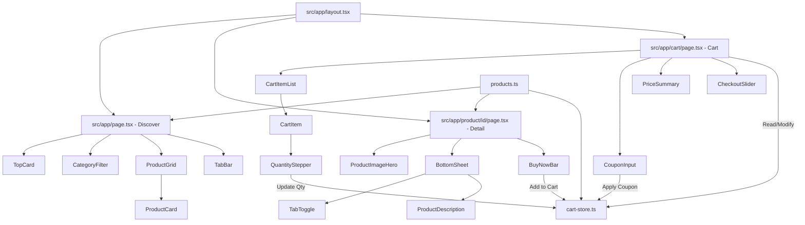

# Technical Specification

# 0. Agent Action Plan

## 0.1 Intent Clarification

### 0.1.1 Core Feature Objective

Based on the prompt, the Blitzy platform understands that the new feature requirement is to **convert a Figma design for an "Online Bike Shopping App" into a fully functional front-end application**. The design contains 1 Figma frame with 3 distinct screens, and each screen must be built as a separate page/route in the front-end code.

The specific feature requirements are:

- **Discover Screen (Home/Browse):** Build a mobile-first product browsing page featuring a promotional banner card with "30% Off" messaging, a horizontal category filter row (All, Electric, Road, Mountain, Accessory), and a 2-column staggered/masonry product card grid displaying bikes and accessories with images, names, categories, prices, and favorite (heart) icons — all rendered against a dark navy/slate theme (#242C3B) with neumorphic styling, gradient strokes, and backdrop blur effects
- **Detail Screen (Product Detail):** Build a product detail page featuring a large product image area with pagination dots, a sliding bottom sheet containing Description/Specification tabs with neumorphic toggle styling, product title, body description text, and a fixed bottom "Buy Now" bar with price display and an "Add to Cart" gradient button
- **Shopping Bag Screen (Cart):** Build a shopping cart page featuring a list of cart items with product images, names, prices, and quantity steppers (increment/decrement), a free shipping banner, a coupon code input field (pre-filled "Bike30"), a price summary section (Subtotal, Delivery Fee, Discount), a total display, and a slide-to-checkout control
- **Shared Navigation:** All screens share a consistent top navigation bar with a gradient back button (44×44px) and page title, plus a tab bar at the bottom of the Discover screen
- **Routing:** Each of the 3 screens must be implemented as a separate route/page within the application

Implicit requirements detected:

- The app targets iOS mobile form factor (390×844 viewport) requiring responsive/mobile-first CSS
- Dark theme is the only mode shown — no light mode variant is required
- Neumorphic design system with gradient fills, gradient strokes (white-to-black at various angles), box shadows (both outset and inset), and backdrop-filter blur effects must be faithfully reproduced
- The Poppins font family (Google Font) is used throughout with weights 400, 500, 600, and 700
- SF Pro Text/Display fonts appear only in the iOS status bar and keyboard — these are system fonts and the status bar is decorative (not functional in a web app)
- Product images are raster assets that must be downloaded from Figma
- The blue-to-purple gradient (#34C8E8 → #4E4AF2) is the primary accent used across buttons, active states, and price displays

### 0.1.2 Special Instructions and Constraints

- **Three Pages, Three Routes:** The user explicitly requires each screen to be "built as a separate page/route" — this mandates a routing framework (Next.js App Router)
- **Figma-to-Code Fidelity:** All visual specifications (colors, spacing, typography, gradients, shadows, border radii) must match the Figma design exactly
- **Greenfield Project:** The repository contains only a `README.md` file — all project scaffolding, configuration, and source code must be created from scratch
- **No Design System Specified:** The user did not reference any component library (e.g., Ant Design, MUI) — the design uses custom neumorphic styling that requires bespoke CSS implementation
- **Mobile-First:** The 390×844 frame size maps to an iPhone 14/15 viewport; the app should be built mobile-first with the design scaled appropriately

### 0.1.3 Technical Interpretation

These feature requirements translate to the following technical implementation strategy:

- To **scaffold the project**, we will create a new Next.js 15 application with TypeScript, Tailwind CSS v4, and the App Router for file-system-based routing
- To **implement the Discover page**, we will create a route at `/` (or `/discover`) containing components for the promotional top card, category filter bar, and a masonry product grid with individual product cards
- To **implement the Detail page**, we will create a dynamic route at `/product/[id]` featuring a product image hero section, a tab-based bottom sheet component (Description/Specification), and a sticky bottom buy-now bar
- To **implement the Shopping Bag page**, we will create a route at `/cart` containing a cart item list with quantity stepper controls, a coupon input section, a price summary breakdown, and a checkout slider control
- To **reproduce the neumorphic design system**, we will define custom Tailwind CSS theme tokens for all gradient fills, gradient strokes, box shadows (including inset neumorphic shadows), backdrop blurs, and border radii extracted from the Figma design
- To **manage shared state**, we will use React Context or Zustand for cart state management across the Detail and Shopping Bag screens
- To **handle navigation**, we will implement Next.js App Router layouts with shared components for the back button header and tab bar

## 0.2 Repository Scope Discovery

### 0.2.1 Comprehensive File Analysis

The repository is a **greenfield project** containing only a single file:

| Existing File | Status | Purpose |
|---|---|---|
| `README.md` | MODIFY | Currently contains only `# figma-sandbox`; update with project documentation |

Since no source code, configuration, or dependencies exist, **every file listed below must be created from scratch**.

**Project Scaffolding Files (Root):**

| File Path | Action | Purpose |
|---|---|---|
| `package.json` | CREATE | Node.js project manifest with all dependencies |
| `package-lock.json` | CREATE | Dependency lock file (auto-generated) |
| `tsconfig.json` | CREATE | TypeScript configuration |
| `next.config.ts` | CREATE | Next.js framework configuration |
| `postcss.config.mjs` | CREATE | PostCSS configuration for Tailwind CSS v4 |
| `.gitignore` | CREATE | Git ignore patterns for node_modules, .next, etc. |
| `.eslintrc.json` | CREATE | ESLint configuration |
| `README.md` | MODIFY | Project documentation with setup and run instructions |

**Tailwind CSS and Styling:**

| File Path | Action | Purpose |
|---|---|---|
| `src/app/globals.css` | CREATE | Global CSS with Tailwind imports, custom @theme tokens, and neumorphic utility classes |

**App Router Layout and Pages:**

| File Path | Action | Purpose |
|---|---|---|
| `src/app/layout.tsx` | CREATE | Root layout with Poppins font loading, metadata, and global providers |
| `src/app/page.tsx` | CREATE | Discover/Home page — product browsing with categories and grid |
| `src/app/product/[id]/page.tsx` | CREATE | Product Detail page — image, bottom sheet, buy now bar |
| `src/app/cart/page.tsx` | CREATE | Shopping Bag page — cart items, coupon, price summary, checkout |

**Shared UI Components:**

| File Path | Action | Purpose |
|---|---|---|
| `src/components/layout/BackButton.tsx` | CREATE | Reusable gradient back navigation button (44×44, blue gradient) |
| `src/components/layout/PageHeader.tsx` | CREATE | Shared top navigation bar with back button and title |
| `src/components/layout/TabBar.tsx` | CREATE | Bottom tab bar for Discover screen (5 tabs) |
| `src/components/layout/StatusBar.tsx` | CREATE | Decorative iOS status bar (time, signal, battery) |
| `src/components/layout/DeviceFrame.tsx` | CREATE | Device frame wrapper with 50px border-radius and screen shadow |

**Discover Page Components:**

| File Path | Action | Purpose |
|---|---|---|
| `src/components/discover/TopCard.tsx` | CREATE | Promotional "30% Off" banner card with gradient bg and blur |
| `src/components/discover/CategoryFilter.tsx` | CREATE | Horizontal category row (All, Electric, Road, Mountain, Accessory) |
| `src/components/discover/CategoryItem.tsx` | CREATE | Individual category icon button with active/inactive states |
| `src/components/discover/ProductGrid.tsx` | CREATE | 2-column staggered/masonry product card grid |
| `src/components/discover/ProductCard.tsx` | CREATE | Product card with image, heart icon, name, category, price |

**Detail Page Components:**

| File Path | Action | Purpose |
|---|---|---|
| `src/components/detail/ProductImageHero.tsx` | CREATE | Large product image area with gradient overlay and dots |
| `src/components/detail/PaginationDots.tsx` | CREATE | Image pagination indicator dots |
| `src/components/detail/BottomSheet.tsx` | CREATE | Sliding bottom sheet container with gradient bg and top-edge stroke |
| `src/components/detail/TabToggle.tsx` | CREATE | Description/Specification neumorphic tab toggle |
| `src/components/detail/ProductDescription.tsx` | CREATE | Product title and body description text |
| `src/components/detail/BuyNowBar.tsx` | CREATE | Fixed bottom bar with price and "Add to Cart" button |

**Cart Page Components:**

| File Path | Action | Purpose |
|---|---|---|
| `src/components/cart/CartItemList.tsx` | CREATE | Scrollable list of cart items with separators |
| `src/components/cart/CartItem.tsx` | CREATE | Individual cart item row (image, name, price, stepper) |
| `src/components/cart/QuantityStepper.tsx` | CREATE | Increment/decrement quantity control with neumorphic inset styling |
| `src/components/cart/CouponInput.tsx` | CREATE | Coupon code input field with Apply button |
| `src/components/cart/PriceSummary.tsx` | CREATE | Subtotal, Delivery Fee, Discount breakdown |
| `src/components/cart/TotalDisplay.tsx` | CREATE | Total price display in accent blue |
| `src/components/cart/CheckoutSlider.tsx` | CREATE | Slide-to-checkout control with gradient handle |

**State Management:**

| File Path | Action | Purpose |
|---|---|---|
| `src/store/cart-store.ts` | CREATE | Cart state management (items, quantities, coupon, totals) |
| `src/store/products.ts` | CREATE | Static product data matching Figma content |

**Type Definitions:**

| File Path | Action | Purpose |
|---|---|---|
| `src/types/product.ts` | CREATE | Product, CartItem, Category type interfaces |

**Static Assets:**

| File Path | Action | Purpose |
|---|---|---|
| `public/images/bike-peugeot-lr01.png` | CREATE | PEUGEOT LR01 road bike product photo (from Figma) |
| `public/images/bike-pilot-chromoly.png` | CREATE | PILOT Chromoly mountain bike product photo (from Figma) |
| `public/images/helmet-smith-trade.png` | CREATE | SMITH Trade helmet product photo (from Figma) |
| `public/images/bike-electric-promo.png` | CREATE | Electric bicycle promo image for top card (from Figma) |
| `public/images/bg-gradient.svg` | CREATE | Background gradient overlay asset |
| `src/assets/icons/search.svg` | CREATE | Search/magnifying glass icon (cart button) |
| `src/assets/icons/heart-outline.svg` | CREATE | Heart outline icon for product favorites |
| `src/assets/icons/chevron-left.svg` | CREATE | Left chevron for back navigation |
| `src/assets/icons/chevron-right.svg` | CREATE | Right chevron for checkout slider |
| `src/assets/icons/plus.svg` | CREATE | Plus icon for quantity stepper |
| `src/assets/icons/minus.svg` | CREATE | Minus icon for quantity stepper |
| `src/assets/icons/tab-home.svg` | CREATE | Tab bar — home/bicycle icon |
| `src/assets/icons/tab-map.svg` | CREATE | Tab bar — map icon |
| `src/assets/icons/tab-cart.svg` | CREATE | Tab bar — shopping cart icon |
| `src/assets/icons/tab-profile.svg` | CREATE | Tab bar — profile icon |
| `src/assets/icons/tab-bookmark.svg` | CREATE | Tab bar — bookmark/document icon |
| `src/assets/icons/category-all.svg` | CREATE | Category — bicycle/all icon |
| `src/assets/icons/category-electric.svg` | CREATE | Category — electric scooter icon |
| `src/assets/icons/category-road.svg` | CREATE | Category — road/helmet icon |
| `src/assets/icons/category-mountain.svg` | CREATE | Category — mountain icon |
| `src/assets/icons/category-accessory.svg` | CREATE | Category — accessory icon |

### 0.2.2 Integration Point Discovery

Since this is a greenfield project, integration points are internal:

- **Routing Integration:** Next.js App Router file-system routing connects all pages via `src/app/` directory structure
- **State Integration:** Cart store (`src/store/cart-store.ts`) is consumed by Detail page (Add to Cart) and Cart page (display, modify, checkout)
- **Product Data Flow:** Static product data (`src/store/products.ts`) feeds into Discover grid, Detail page, and Cart items
- **Asset Pipeline:** Product images in `public/images/` are referenced by Next.js `<Image>` components; SVG icons in `src/assets/icons/` are imported as React components
- **Theme System:** All custom design tokens defined in `src/app/globals.css` via Tailwind CSS `@theme` directive are consumed by every component

### 0.2.3 Web Search Research Conducted

- **Next.js 15:** Confirmed as the latest stable production-ready version with App Router, Turbopack, and React 19 support
- **React 19.2:** Latest stable release (December 2025) with stable Server Components, Actions, and concurrent rendering
- **Tailwind CSS v4.2.1:** Latest stable version with CSS-first configuration via `@theme` directives, zero-config content detection, and Vite plugin integration
- **Neumorphic CSS Patterns:** Complex box-shadow combinations (outset + inset), gradient strokes via `border-image` or pseudo-elements, and `backdrop-filter: blur()` — all implementable with custom Tailwind utilities

## 0.3 Dependency Inventory

### 0.3.1 Private and Public Packages

Since this is a greenfield project with no existing dependency manifest, all packages below must be installed fresh. Versions are verified against npm registry and official release channels.

**Core Dependencies:**

| Registry | Package Name | Version | Purpose |
|---|---|---|---|
| npm | `next` | `^15.5.0` | Next.js framework with App Router for file-system routing and server-side rendering |
| npm | `react` | `^19.2.0` | React UI library — latest stable with concurrent rendering and Server Components |
| npm | `react-dom` | `^19.2.0` | React DOM renderer — paired with React 19 |

**Styling Dependencies:**

| Registry | Package Name | Version | Purpose |
|---|---|---|---|
| npm | `tailwindcss` | `^4.2.1` | Utility-first CSS framework v4 with CSS-native configuration |
| npm | `@tailwindcss/postcss` | `^4.2.1` | PostCSS plugin for Tailwind CSS v4 integration with Next.js |

**Font Loading:**

| Registry | Package Name | Version | Purpose |
|---|---|---|---|
| npm | `@next/font` (built-in) | — | Next.js built-in font optimization — used for loading Poppins from Google Fonts |

**State Management:**

| Registry | Package Name | Version | Purpose |
|---|---|---|---|
| npm | `zustand` | `^5.0.0` | Lightweight state management for cart state (items, quantities, coupon, totals) |

**Development Dependencies:**

| Registry | Package Name | Version | Purpose |
|---|---|---|---|
| npm | `typescript` | `^5.7.0` | TypeScript compiler for type-safe development |
| npm | `@types/react` | `^19.0.0` | TypeScript type definitions for React 19 |
| npm | `@types/react-dom` | `^19.0.0` | TypeScript type definitions for React DOM 19 |
| npm | `@types/node` | `^22.0.0` | TypeScript type definitions for Node.js APIs |
| npm | `eslint` | `^9.0.0` | JavaScript/TypeScript linter |
| npm | `eslint-config-next` | `^15.5.0` | Next.js ESLint configuration preset |

### 0.3.2 Dependency Updates

Since this is a greenfield project, there are no existing imports or references to update. All imports will be established fresh in newly created files.

**Import Patterns to Establish:**

- `next/font/google` — for Poppins font loading in `src/app/layout.tsx`
- `next/image` — for optimized image rendering across all product images
- `next/link` — for client-side navigation between routes
- `next/navigation` — for `useRouter`, `useParams` in Detail page
- `react` — for hooks (`useState`, `useCallback`, `useMemo`) in interactive components
- `zustand` — for `create` store function in `src/store/cart-store.ts`
- `zustand/middleware` — for `persist` middleware to maintain cart state across page navigations

**External Reference Configuration:**

| File | Configuration Required |
|---|---|
| `package.json` | All dependencies listed above with `scripts` for dev, build, start, lint |
| `tsconfig.json` | Strict mode, path aliases (`@/*` → `src/*`), JSX preserve, Next.js plugin |
| `next.config.ts` | Image domains configuration (if external images), Turbopack enabled |
| `postcss.config.mjs` | `@tailwindcss/postcss` plugin registration |
| `.eslintrc.json` | Extends `next/core-web-vitals` and `next/typescript` |

## 0.4 Integration Analysis

### 0.4.1 Existing Code Touchpoints

Since this is a greenfield project, there are no existing code touchpoints to modify. The sole existing file requires update:

- **`README.md`**: Update from placeholder heading to full project documentation including setup instructions, available scripts, project structure, and development workflow

### 0.4.2 Internal Integration Architecture

All integration points are between newly created modules. The following diagram illustrates the data flow and component relationships:



### 0.4.3 Route Integration Points

| Route | Path | Source Page | Connected To |
|---|---|---|---|
| Discover | `/` | `src/app/page.tsx` | Product Detail via `ProductCard` click → `/product/[id]` |
| Detail | `/product/[id]` | `src/app/product/[id]/page.tsx` | Cart via "Add to Cart" button → cart store; Back to Discover via BackButton |
| Cart | `/cart` | `src/app/cart/page.tsx` | Back to previous page via BackButton; Checkout action via CheckoutSlider |

### 0.4.4 State Integration Map

**Cart Store (`src/store/cart-store.ts`)** serves as the central data hub:

| Consumer | Action | Data Flow |
|---|---|---|
| `BuyNowBar.tsx` (Detail) | `addToCart(product, quantity)` | Writes product + quantity to cart store |
| `CartItemList.tsx` (Cart) | `getCartItems()` | Reads all items from cart store |
| `QuantityStepper.tsx` (Cart) | `updateQuantity(id, delta)` | Modifies item quantity in cart store |
| `CouponInput.tsx` (Cart) | `applyCoupon(code)` | Applies discount code ("Bike30" → 30% off) |
| `PriceSummary.tsx` (Cart) | `getSubtotal()`, `getDiscount()`, `getDeliveryFee()` | Reads computed values from cart store |
| `TotalDisplay.tsx` (Cart) | `getTotal()` | Reads final computed total |
| `TabBar.tsx` (Discover) | `getCartCount()` | Reads item count for cart badge (optional) |

### 0.4.5 Asset Integration

| Asset Type | Location | Integration Method |
|---|---|---|
| Product images (PNG) | `public/images/` | Next.js `<Image>` component with `src="/images/filename.png"` |
| SVG icons | `src/assets/icons/` | Imported as React components or via `<Image>` |
| Background gradient | `public/images/bg-gradient.svg` | CSS `background-image` or positioned `<Image>` |
| Google Font (Poppins) | CDN via `next/font/google` | Applied globally in `layout.tsx`, exposed as CSS variable |

### 0.4.6 Theme Token Integration

All components consume design tokens defined in `src/app/globals.css`:

- **Color tokens** (fills, text colors, gradients) → used via Tailwind utility classes
- **Shadow tokens** (neumorphic inset/outset) → applied via custom utility classes defined with `@utility`
- **Spacing tokens** (padding, gaps, margins) → standard Tailwind spacing scale with arbitrary values where needed
- **Border radius tokens** (50px, 30px, 20px, 10px, 8px) → defined in `@theme` and used via `rounded-*` utilities
- **Gradient definitions** (button gradient, card gradient, stroke gradient) → defined as reusable CSS custom properties

## 0.5 Figma Design Analysis

### 0.5.1 Screen Summary

The Figma file "Online Bike Shopping App (Community)" (file key: `6FWdXDJV3foFfDfOhmkORj`) contains 3 primary screens within the "iOS" canvas (frame 1:40, 1800×1200), each representing a 390×844 mobile viewport with 50px border-radius device framing.

---

**Screen 1: Discover (Node 1:42) — 390×844**

Purpose: Home/browse screen for discovering and filtering bike products.

Key UI elements:
- **Status Bar** (1:45): Decorative iOS status bar with "9:41" in SF Pro Text 600 15px #FFFFFF, signal/wifi/battery icons
- **Top Navigation** (1:46): "Choose Your Bike" heading in Poppins 700 20px #FFFFFF with a 44×44 search/cart button (fill: linear-gradient(142deg, #34C8E8 0%, #4E4AF2 100%), borderRadius: 10px, stroke: gradient 1px, shadow: effect_OL2ETJ)
- **Top Promotional Card** (1:143): 350×240 card with fill: linear-gradient(159deg, #353F54 27%, #222834 85%), 2px gradient stroke, 20px radius, backdrop-filter blur(100px), containing electric bicycle image and "30% Off" text in Poppins 700 26px rgba(255,255,255,0.6)
- **Category Filter Row** (1:50): 5 category icons at y:368, each 50×50 with borderRadius: 10px — "All" (1:51, active, blue gradient fill), "Electric" (1:54), "Road" (1:57), "Mountain" (1:65, with blur(30px)), "Accessory" (1:68)
- **Product Grid** (1:71): 2-column staggered grid at y:442 containing 6 ProductCard instances (1:73, 1:87, 1:100, 1:110, 1:120, 1:129), each with gradient dark fill, 2px gradient stroke, 20px radius, neumorphic shadows, heart icon (24×24), product image, category label (Poppins 500 13px rgba(255,255,255,0.6)), product name (Poppins 700 15px #FFFFFF), price (Poppins 500 13px rgba(255,255,255,0.6))
- **Tab Bar** (1:150): IMAGE-SVG 390×103.5 at y:741 with 5 tab icons — home (active, gradient bg #34C8E8→#4E4AF2), map, cart, profile, bookmark

User flow: Entry point → tap product card → Detail screen; tap cart tab → Cart screen.

---

**Screen 2: Detail (Node 1:180) — 390×844**

Purpose: Product detail page displaying product information and purchase action.

Key UI elements:
- **Top Navigation** (1:210): Back button (44×44, gradient fill #34C8E8→#4E4AF2, borderRadius: 10px, white chevron-left icon) + "PEUGEOT - LR01" title (Poppins 700 20px #FFFFFF), gap: 56px
- **Product Image Area** (1:202): Large road bike image 287.73×222.02 centered on dark background with diagonal blue gradient overlay (BG 1:182)
- **Pagination Dots**: 3 dots below image — first white/active, two darker/inactive
- **Bottom Sheet** (1:184): 390×450 at y:394, borderRadius: 30px, fill: linear-gradient(145deg, #353F54 0%, #222834 61%), stroke: linear-gradient(181deg, #FFF 0%, transparent 14%) 2px, shadow: 0px -20px 60px rgba(0,0,0,0.25)
  - **Tab Toggle** (1:186): "Description" tab (1:188, active: fill #323B4F, outset shadow, text gradient fill #3CA4EB→#4286EE, Poppins 700 15px) and "Specification" tab (1:190, inactive: fill #28303F, inset shadow, text rgba(255,255,255,0.6), Poppins 400 15px)
  - **Description Content** (1:199): "PEUGEOT - LR01" (Poppins 700 17px #FFFFFF) + body paragraph (Poppins 400 15px rgba(255,255,255,0.6), width: 335px)
- **Buy Now Bar** (1:192): 390×104 at y:346 (bottom), fill: #262E3D, borderRadius: 50px, stroke: gradient 2px, shadow: 0px -10px 40px rgba(28,34,46,1)
  - Price: "$ 1,999.99" (Poppins 400 24px #3D9CEA)
  - "Add to Cart" button: 160×44, fill: linear-gradient(142deg, #34C8E8 0%, #4E4AF2 100%), borderRadius: 10px, stroke: gradient 2px, shadow: 0px 30px 60px rgba(26,31,44,1), text: Poppins 500 15px #FFFFFF

User flow: Navigated from Discover → view product → tap "Add to Cart" → item added to cart; tap back button → return to Discover.

---

**Screen 3: Shopping Bag (Node 1:214) — 390×844**

Purpose: Shopping cart with item management, coupon application, and checkout.

Key UI elements:
- **Top Navigation** (1:303): Back button (44×44, gradient fill, white chevron) + "My Shopping Cart" (Poppins 700 20px #FFFFFF)
- **Cart Items** (1:240): 390×356 at y:136, 3 cart items separated by thin lines (rgba(255,255,255,0.5) 0.5px):
  - Each item: product image (100×90, borderRadius: 10px, dark bg), name (Poppins 700 15px rgba(255,255,255,0.87)), price (Poppins 400 13px #3C9EEA), quantity stepper (79×30, borderRadius: 8px, inset shadows, "+" gradient button / "1" count / "−" dark button)
  - Item 1: "PEUGEOT- LR01" / "$ 1,999.99"
  - Item 2: "PILOT – CHROMOLY 520" / "$ 3,999.99"
  - Item 3: "SMITH – Trade" / "$ 120"
- **Free Shipping Banner** (1:216): "Your cart qualifies for free shipping" (Poppins 400 15px rgba(255,255,255,0.6)) at y:516
- **Coupon Section** (1:217): 350×44 at y:563 — input field (fill: #242C3B, borderRadius: 8px, inset shadow, "Bike30" text Poppins 400 13px rgba(255,255,255,0.6)) + "Apply" button (114×44, gradient fill, borderRadius: 10px, Poppins 700 13px #FFFFFF)
- **Price Summary** (1:223) at y:623: "Subtotal:" / "$6119.99", "Delivery Fee:" / "$0", "Discount:" / "30%" — labels Poppins 500 15px rgba(255,255,255,0.87), values Poppins 400 15px rgba(255,255,255,0.6)
- **Total** (1:337) at y:724: "Total:" Poppins 500 15px rgba(255,255,255,0.87), "$4,283.99" Poppins 700 17px #38B8EA
- **Checkout Slider** (1:233): 174×44 at y:770, borderRadius: 10px, inset shadows, "Checkout" text Poppins 500 15px rgba(255,255,255,0.6), slide handle 44×44 gradient blue with white right chevron

User flow: Navigated from tab bar or after adding items → adjust quantities → apply coupon "Bike30" → 30% discount applied → slide to checkout.

### 0.5.2 Token Manifest

Tokens extracted from Phase 2 Reconciliation across all 3 screens. Only CONFIRMED values appearing 2+ times are tokenized.

**Color Tokens:**

| Category | Token Name | Value | Usage Count |
|---|---|---|---|
| Color | color-bg-primary | #242C3B | 12 |
| Color | color-text-white | #FFFFFF | 30+ |
| Color | color-text-muted | rgba(255,255,255,0.6) | 18 |
| Color | color-text-semi | rgba(255,255,255,0.87) | 6 |
| Color | color-accent-blue-1 | #3D9CEA | 2 |
| Color | color-accent-blue-2 | #3C9EEA | 3 |
| Color | color-accent-blue-3 | #38B8EA | 2 |
| Color | color-surface-sheet | #262E3D | 2 |
| Color | color-tab-active | #323B4F | 2 |
| Color | color-tab-inactive | #28303F | 2 |
| Color | color-separator | rgba(255,255,255,0.5) | 3 |
| Gradient | gradient-primary-button | linear-gradient(142deg, #34C8E8 0%, #4E4AF2 100%) | 8 |
| Gradient | gradient-card-dark | linear-gradient(159deg, #353F54 27%, #222834 85%) | 8 |
| Gradient | gradient-card-darker | linear-gradient(154deg, #363E51 26%, #191E26 72%) | 4 |
| Gradient | gradient-sheet | linear-gradient(145deg, #353F54 0%, #222834 61%) | 2 |
| Gradient | gradient-tab-text | linear-gradient(90deg, #3CA4EB 0%, #4286EE 100%) | 2 |
| Gradient | gradient-blue-overlay | linear-gradient(150deg, #37B6E9 1%, #4B4CED 91%) | 2 |

**Stroke Tokens:**

| Category | Token Name | Value | Usage Count |
|---|---|---|---|
| Stroke | stroke-button | linear-gradient(135deg, #FFF 0%, #000 100%) 1px | 4 |
| Stroke | stroke-card-bold | linear-gradient(115deg, #FFF 8%, #000 77%) 2px | 6 |
| Stroke | stroke-category | linear-gradient(108deg, #FFF 8%, #000 82%) 1px | 3 |
| Stroke | stroke-sheet-top | linear-gradient(181deg, #FFF 0%, transparent 14%) 2px | 2 |
| Stroke | stroke-buynow | linear-gradient(180deg, #FFF 0%, #000 69%) 2px | 2 |

**Spacing Tokens:**

| Category | Token Name | Value | Usage Count |
|---|---|---|---|
| Spacing | space-page-x | 20px | 12 |
| Spacing | space-section-gap | 30px | 3 |
| Spacing | space-nav-gap-wide | 127px | 1 (one-off) |
| Spacing | space-nav-gap-narrow | 56px | 1 (one-off) |

**Typography Tokens:**

| Category | Token Name | Value | Usage Count |
|---|---|---|---|
| Typography | text-page-title | Poppins / 700 / 20px / 1.5em | 4 |
| Typography | text-section-heading | Poppins / 700 / 17px / 1.5em / -1.76% | 2 |
| Typography | text-promo | Poppins / 700 / 26px / 1.5em | 1 (one-off) |
| Typography | text-product-name | Poppins / 700 / 15px / 1.5em / -2% | 8 |
| Typography | text-body | Poppins / 400 / 15px / 1.5em / -2% | 6 |
| Typography | text-button | Poppins / 500 / 15px / 1.5em / -2% | 4 |
| Typography | text-small-label | Poppins / 500 / 13px / 1.5em | 6 |
| Typography | text-small-body | Poppins / 400 / 13px / 1.5em / -0.62% | 4 |
| Typography | text-small-bold | Poppins / 700 / 13px / 1.5em / -0.62% | 2 |
| Typography | text-price-large | Poppins / 400 / 24px / 1.5em / -1.25% | 2 |
| Typography | text-quantity | Poppins / 600 / 13px / 1.5em / -2.3% | 3 |

**Border Radius Tokens:**

| Category | Token Name | Value | Usage Count |
|---|---|---|---|
| Radius | radius-device | 50px | 3 |
| Radius | radius-sheet | 30px | 2 |
| Radius | radius-card | 20px | 8 |
| Radius | radius-button | 10px | 14 |
| Radius | radius-input | 8px | 3 |

**Shadow Tokens:**

| Category | Token Name | Value | Usage Count |
|---|---|---|---|
| Shadow | shadow-screen | 0px 30px 100px rgba(82,108,143,1) | 3 |
| Shadow | shadow-button | 0px 20px 30px rgba(16,20,28,1), 0px -20px 30px rgba(43,52,69,0.5) | 4 |
| Shadow | shadow-card | 0px 20px 60px rgba(16,20,28,1), 0px -20px 40px rgba(43,52,69,0.5) | 8 |
| Shadow | shadow-sheet | 0px -20px 60px rgba(0,0,0,0.25) | 2 |
| Shadow | shadow-buynow | 0px -10px 40px rgba(28,34,46,1) | 2 |
| Shadow | shadow-cta | 0px 30px 60px rgba(26,31,44,1) | 2 |
| Shadow | shadow-neumorphic-outset | 4px 4px 10px rgba(37,43,57,1), -4px -4px 10px rgba(56,68,90,1) | 2 |
| Shadow | shadow-neumorphic-inset | inset 4px 4px 8px rgba(32,38,51,1), inset -4px -4px 8px rgba(54,64,85,1) | 2 |
| Shadow | shadow-stepper-inset | inset 2px 2px 4px rgba(30,37,49,1), inset -2px -2px 4px rgba(39,48,65,1) | 3 |
| Shadow | shadow-coupon-inset | inset 4px 10px 30px rgba(25,30,41,1) | 2 |
| Shadow | shadow-checkout-inset | inset 4px 4px 30px rgba(17,22,30,1), inset -2px -2px 8px rgba(43,53,69,1) | 2 |

**Blur Tokens:**

| Category | Token Name | Value | Usage Count |
|---|---|---|---|
| Blur | blur-category | backdrop-filter: blur(30px) | 2 |
| Blur | blur-card | backdrop-filter: blur(40px) | 2 |
| Blur | blur-topcard | backdrop-filter: blur(100px) | 2 |

### 0.5.3 Component Inventory

Components identified from Figma Main Components and repeated patterns across screens:

| Component Name | Variants | Props Interface | Per-Variant Visual Specs | Figma Node |
|---|---|---|---|---|
| DeviceFrame | — | children: ReactNode | 390×844, fill #242C3B, radius 50px, shadow 0px 30px 100px rgba(82,108,143,1) | 1:42, 1:180, 1:214 |
| StatusBar | — | — | SF Pro Text 600 15px #FFFFFF, "9:41", signal/wifi/battery icons | 1:7 (component) |
| PageHeader | with-search, with-back | title: string, showSearch?: bool, onBack?: fn | with-search: title left + 44×44 gradient button right, gap 127px; with-back: 44×44 gradient back button + title, gap 56px | 1:46, 1:210, 1:303 |
| BackButton | — | onClick: fn | 44×44, fill gradient-primary-button, radius 10px, stroke gradient 1px, shadow shadow-button, white chevron-left icon | 4:1395 (component) |
| TopCard | — | discount: string, image: string | 350×240, fill gradient-card-dark, stroke 2px gradient, radius 20px, shadow + blur(100px), image + "30% Off" text Poppins 700 26px rgba(255,255,255,0.6) | 1:143 |
| CategoryItem | active, inactive | icon: ReactNode, label?: string, isActive: bool | active: fill gradient-primary-button, white icon; inactive: fill gradient-card-darker, radius 10px, 50×50, gradient stroke 1px | 1:51–1:68 |
| ProductCard | — | image: string, category: string, name: string, price: string, isFavorited: bool, onClick: fn | 165×(235–255), fill gradient-card-dark, stroke 2px gradient, radius 20px, shadow shadow-card; heart icon 24×24 top-right; category Poppins 500 13px rgba(255,255,255,0.6); name Poppins 700 15px #FFFFFF; price Poppins 500 13px rgba(255,255,255,0.6) | 1:73 (template) |
| TabBar | — | activeTab: number, onTabChange: fn | 390×103.5, 5 icon tabs; active: gradient bg square + white icon; inactive: gray/white outline icon | 1:150 |
| BottomSheet | — | children: ReactNode | 390×450, fill gradient-sheet, stroke stroke-sheet-top, radius 30px, shadow shadow-sheet | 1:184 |
| TabToggle | — | activeTab: string, onTabChange: fn, tabs: string[] | active: fill #323B4F, outset shadow, gradient text Poppins 700 15px; inactive: fill #28303F, inset shadow, Poppins 400 15px rgba(255,255,255,0.6); radius 10px | 1:186 |
| BuyNowBar | — | price: string, onAddToCart: fn | 390×104, fill #262E3D, radius 50px, stroke gradient 2px, shadow shadow-buynow; price Poppins 400 24px #3D9CEA; button 160×44 gradient, Poppins 500 15px #FFFFFF | 1:192 |
| CartItem | — | image: string, name: string, price: string, quantity: number, onIncrement: fn, onDecrement: fn | Row: 100×90 image (radius 10px) + text col (name Poppins 700 15px rgba(255,255,255,0.87), price Poppins 400 13px #3C9EEA) + QuantityStepper; separator rgba(255,255,255,0.5) 0.5px | 1:240 children |
| QuantityStepper | — | value: number, onIncrement: fn, onDecrement: fn | 79×30, radius 8px, inset shadow shadow-stepper-inset; "+" gradient button, count Poppins 600 13px #FFFFFF, "−" dark button | within 1:240 |
| CouponInput | — | value: string, onChange: fn, onApply: fn | 350×44; input: fill #242C3B, radius 8px, inset shadow, Poppins 400 13px rgba(255,255,255,0.6); "Apply" button: 114×44, gradient fill, radius 10px, Poppins 700 13px #FFFFFF | 1:217 |
| PriceSummary | — | subtotal: string, delivery: string, discount: string | Labels Poppins 500 15px rgba(255,255,255,0.87), values Poppins 400 15px rgba(255,255,255,0.6) | 1:223 |
| CheckoutSlider | — | onCheckout: fn | 174×44, radius 10px, inset shadow shadow-checkout-inset; "Checkout" Poppins 500 15px rgba(255,255,255,0.6); 44×44 gradient handle with white chevron-right | 1:233 |
| PaginationDots | — | total: number, active: number | 3 dots, active: white fill, inactive: dark fill; variant component 1:25 "Dots" | 1:25 (component set) |

### 0.5.4 Asset Inventory

**Note on Asset Downloads:** Persistent Figma API rate limiting (HTTP 429) prevented SVG icon downloads during the inspection session. All icon and vector assets listed below must be downloaded by downstream agents using the provided Figma File Key and Node IDs. Product images are referenced by `imageRef` and must be exported separately.

**State Groups:**

| State Group | States and Node IDs | Parent Component |
|---|---|---|
| category-item | active → blue gradient fill, inactive → dark gradient fill (nodes 1:51–1:68) | CategoryFilter |
| tab-toggle | active → outset shadow + gradient text (1:188), inactive → inset shadow + muted text (1:190) | TabToggle |
| tab-bar-item | active → gradient bg square (within 1:150), inactive → outline icon (within 1:150) | TabBar |
| heart-icon | outlined → white stroke (within product cards 1:73–1:129) | ProductCard |

**Included Assets (downstream agents must create a file for every row):**

| Asset Filename | Type | Figma Node ID | Figma File Key | State Group | Description | Target Path |
|---|---|---|---|---|---|---|
| bike-peugeot-lr01.png | static-image | 1:73 (imageRef: 9bfdbe79) | 6FWdXDJV3foFfDfOhmkORj | — | PEUGEOT LR01 road bike product photo | public/images/ |
| bike-pilot-chromoly.png | static-image | 1:87 (imageRef: f4f9823b) | 6FWdXDJV3foFfDfOhmkORj | — | PILOT Chromoly mountain bike product photo | public/images/ |
| helmet-smith-trade.png | static-image | 1:100 (imageRef: 15170c2a) | 6FWdXDJV3foFfDfOhmkORj | — | SMITH Trade helmet product photo | public/images/ |
| bike-electric-promo.png | static-image | 1:143 (imageRef: 024d5f31) | 6FWdXDJV3foFfDfOhmkORj | — | Electric bicycle promo image for top card | public/images/ |
| bg-gradient.svg | static-image | 1:43 | 6FWdXDJV3foFfDfOhmkORj | — | Background diagonal blue gradient overlay | public/images/ |
| search-icon.svg | static-icon | 1:48 | 6FWdXDJV3foFfDfOhmkORj | — | Magnifying glass search icon (nav button) | src/assets/icons/ |
| heart-outline.svg | static-icon | 1:83 | 6FWdXDJV3foFfDfOhmkORj | heart-icon | Heart outline favorite icon | src/assets/icons/ |
| chevron-left.svg | static-icon | 4:1395 | 6FWdXDJV3foFfDfOhmkORj | — | Left chevron for back navigation (component) | src/assets/icons/ |
| chevron-right.svg | static-icon | 1:236 | 6FWdXDJV3foFfDfOhmkORj | — | Right chevron for checkout slider | src/assets/icons/ |
| plus-icon.svg | static-icon | 1:258 | 6FWdXDJV3foFfDfOhmkORj | — | Plus icon for quantity increment | src/assets/icons/ |
| minus-icon.svg | static-icon | 1:253 | 6FWdXDJV3foFfDfOhmkORj | — | Minus icon for quantity decrement | src/assets/icons/ |
| tab-bar.png | static-image | 1:150 | 6FWdXDJV3foFfDfOhmkORj | — | Full tab bar composite (fallback if individual tabs cannot be extracted) | public/images/ |
| category-all.svg | static-icon | 1:51 | 6FWdXDJV3foFfDfOhmkORj | category-item | Bicycle/All category icon | src/assets/icons/ |
| category-electric.svg | static-icon | 1:54 | 6FWdXDJV3foFfDfOhmkORj | category-item | Electric scooter category icon | src/assets/icons/ |
| category-road.svg | static-icon | 1:57 | 6FWdXDJV3foFfDfOhmkORj | category-item | Road/helmet category icon | src/assets/icons/ |
| category-mountain.svg | static-icon | 1:65 | 6FWdXDJV3foFfDfOhmkORj | category-item | Mountain category icon | src/assets/icons/ |
| category-accessory.svg | static-icon | 1:68 | 6FWdXDJV3foFfDfOhmkORj | category-item | Accessory category icon | src/assets/icons/ |

**18 assets total: 18 included, 0 excluded.**

**Excluded Assets:** None. All identified assets are visually present and CONFIRMED in Phase 2 Reconciliation.

### 0.5.5 Screen Element Map

```
Screen: Discover (1:42) — 390×844
├─ BG (1:43) — ASSET(static-image)
├─ Status Bar (1:45) — CONFIRMED [Instance of 1:7]
│  ├─ Battery — CONFIRMED
│  ├─ Wifi — CONFIRMED
│  ├─ Cellular Connection — CONFIRMED
│  └─ Time "9:41" TEXT — CONFIRMED
├─ Top Navigation (1:46) — CONFIRMED
│  ├─ "Choose Your Bike" TEXT — CONFIRMED
│  └─ Cart Button — CONFIRMED
│     └─ Search Icon — ASSET(static-icon)
├─ Top Card (1:143) — CONFIRMED
│  ├─ Electric Bicycle Image — ASSET(static-image)
│  └─ "30% Off" TEXT — CONFIRMED
├─ Categories (1:50) — CONFIRMED
│  ├─ Bicycle/All (1:51) — CONFIRMED [active]
│  ├─ Electric (1:54) — CONFIRMED
│  ├─ Road (1:57) — CONFIRMED
│  ├─ Mountain (1:65) — CONFIRMED
│  └─ Accessory (1:68) — CONFIRMED
├─ Items Grid (1:71) — CONFIRMED
│  ├─ Items 1 / PEUGEOT-LR01 (1:73) — CONFIRMED
│  │  ├─ Product Image — ASSET(static-image)
│  │  ├─ Heart Icon — ASSET(static-icon)
│  │  ├─ "Road Bike" TEXT — CONFIRMED
│  │  ├─ "PEUGEOT - LR01" TEXT — CONFIRMED
│  │  └─ "$ 1,999.99" TEXT — CONFIRMED
│  ├─ Items 4 / PILOT-Chromoly (1:87) — CONFIRMED
│  ├─ Items 3 / SMITH-Trade (1:100) — CONFIRMED
│  ├─ Items 9 (1:110) — CONFIRMED
│  ├─ Items 5 (1:120) — CONFIRMED
│  └─ Items 6 (1:129) — CONFIRMED
└─ Tab Bar (1:150) — ASSET(static-image)

Screen: Detail (1:180) — 390×844
├─ Status Bar (1:181) — CONFIRMED [Instance of 1:7]
├─ BG (1:182) — ASSET(static-image)
├─ Top Navigation (1:210) — CONFIRMED
│  ├─ Back Button (44×44) — CONFIRMED
│  │  └─ Chevron Left Icon — ASSET(static-icon)
│  └─ "PEUGEOT - LR01" TEXT — CONFIRMED
├─ Product Image (1:202) — ASSET(static-image)
├─ Pagination Dots — CONFIRMED [Instance of 1:25 "Dots"]
└─ Bottom Sheet (1:184) — CONFIRMED
   ├─ Sheet Background (1:185) — CONFIRMED
   ├─ Categories Tabs (1:186) — CONFIRMED
   │  ├─ Description Tab (1:188) — CONFIRMED [active]
   │  └─ Specification Tab (1:190) — CONFIRMED [inactive]
   ├─ Description Content (1:199) — CONFIRMED
   │  ├─ "PEUGEOT - LR01" TEXT — CONFIRMED
   │  └─ Body Description TEXT — CONFIRMED
   └─ Buy Now Section (1:192) — CONFIRMED
      ├─ "$ 1,999.99" TEXT — CONFIRMED
      └─ "Add to Cart" Button — CONFIRMED

Screen: Shopping Bag (1:214) — 390×844
├─ Status Bar (1:215) — CONFIRMED [Instance of 1:7]
├─ Top Navigation (1:303) — CONFIRMED
│  ├─ Back Button (44×44) — CONFIRMED
│  │  └─ Chevron Left Icon — ASSET(static-icon)
│  └─ "My Shopping Cart" TEXT — CONFIRMED
├─ Cart Items (1:240) — CONFIRMED
│  ├─ Item 1: PEUGEOT-LR01 — CONFIRMED
│  │  ├─ Product Image (100×90) — ASSET(static-image)
│  │  ├─ "PEUGEOT- LR01" TEXT — CONFIRMED
│  │  ├─ "$ 1,999.99" TEXT — CONFIRMED
│  │  └─ Quantity Stepper — CONFIRMED
│  │     ├─ "+" Button — CONFIRMED
│  │     ├─ "1" Count TEXT — CONFIRMED
│  │     └─ "−" Button — CONFIRMED
│  ├─ Separator — CONFIRMED
│  ├─ Item 2: PILOT-CHROMOLY 520 — CONFIRMED
│  ├─ Separator — CONFIRMED
│  └─ Item 3: SMITH-Trade — CONFIRMED
├─ Free Shipping Banner (1:216) — CONFIRMED
│  └─ "Your cart qualifies for free shipping" TEXT — CONFIRMED
├─ Coupon Section (1:217) — CONFIRMED
│  ├─ Coupon Input ("Bike30") — CONFIRMED
│  └─ "Apply" Button — CONFIRMED
├─ Price Summary (1:223) — CONFIRMED
│  ├─ "Subtotal:" / "$6119.99" — CONFIRMED
│  ├─ "Delivery Fee:" / "$0" — CONFIRMED
│  └─ "Discount:" / "30%" — CONFIRMED
├─ Total (1:337) — CONFIRMED
│  ├─ "Total:" TEXT — CONFIRMED
│  └─ "$4,283.99" TEXT — CONFIRMED
└─ Checkout Slide (1:233) — CONFIRMED
   ├─ "Checkout" TEXT — CONFIRMED
   └─ Slide Handle (44×44) — CONFIRMED
      └─ Chevron Right Icon — ASSET(static-icon)
```

## 0.6 Technical Implementation

### 0.6.1 File-by-File Execution Plan

Every file listed below MUST be created or modified. Files are grouped by implementation priority.

**Group 1 — Project Scaffolding and Configuration:**

- **CREATE: `package.json`** — Define project name "figma-sandbox", scripts (dev, build, start, lint), and all dependencies: next@^15.5.0, react@^19.2.0, react-dom@^19.2.0, tailwindcss@^4.2.1, @tailwindcss/postcss@^4.2.1, zustand@^5.0.0, plus dev dependencies (typescript@^5.7.0, @types/react@^19.0.0, @types/react-dom@^19.0.0, @types/node@^22.0.0, eslint@^9.0.0, eslint-config-next@^15.5.0)
- **CREATE: `tsconfig.json`** — Configure strict TypeScript with path aliases (`@/*` → `./src/*`), JSX preserve, module resolution bundler, Next.js plugin, include `src/**/*.ts`, `src/**/*.tsx`
- **CREATE: `next.config.ts`** — Minimal Next.js configuration with Turbopack enabled for development
- **CREATE: `postcss.config.mjs`** — Register `@tailwindcss/postcss` plugin
- **CREATE: `.eslintrc.json`** — Extend `next/core-web-vitals` and `next/typescript`
- **CREATE: `.gitignore`** — Standard Next.js ignore patterns: `.next/`, `node_modules/`, `out/`, `.env*`
- **MODIFY: `README.md`** — Replace placeholder with project documentation: description, tech stack, setup instructions, available scripts, project structure overview

**Group 2 — Design System and Theme Foundation:**

- **CREATE: `src/app/globals.css`** — Import Tailwind CSS v4 (`@import "tailwindcss"`), define `@theme` block with all custom tokens from the Token Manifest (colors, gradients, radii, shadows), define `@utility` directives for neumorphic shadow classes (shadow-card, shadow-button, shadow-neumorphic-outset, shadow-neumorphic-inset, shadow-stepper-inset, shadow-coupon-inset, shadow-checkout-inset), gradient stroke pseudo-element mixins, and backdrop blur utilities
- **CREATE: `src/app/layout.tsx`** — Root layout importing Poppins from `next/font/google` (weights 400, 500, 600, 700), applying font CSS variable, wrapping children in DeviceFrame, setting metadata (title, description, viewport)
- **CREATE: `src/types/product.ts`** — Define TypeScript interfaces: `Product` (id, name, category, price, image, description), `CartItem` (product, quantity), `Category` (id, name, icon, isActive)

**Group 3 — Static Data and State Management:**

- **CREATE: `src/store/products.ts`** — Static product data array containing 3 products matching Figma content: PEUGEOT LR01 ($1,999.99, "Road Bike"), PILOT Chromoly 520 ($3,999.99, "Mountain Bike"), SMITH Trade ($120, "Road Helmet"), plus category definitions (All, Electric, Road, Mountain, Accessory)
- **CREATE: `src/store/cart-store.ts`** — Zustand store with persist middleware managing: `items` (CartItem[]), `addToCart(product)`, `removeFromCart(id)`, `updateQuantity(id, delta)`, `couponCode` (string), `applyCoupon(code)`, computed `subtotal`, `deliveryFee`, `discount`, `total`; coupon logic: "Bike30" → 30% discount, delivery fee: $0 when cart qualifies

**Group 4 — Shared Layout Components:**

- **CREATE: `src/components/layout/DeviceFrame.tsx`** — Wrapper div with 390×844 dimensions, bg-[#242C3B], rounded-[50px], shadow screen container, overflow hidden, centered on page
- **CREATE: `src/components/layout/StatusBar.tsx`** — Decorative iOS status bar showing "9:41" time, signal/wifi/battery icons positioned at top of screen
- **CREATE: `src/components/layout/PageHeader.tsx`** — Conditional header: when `showSearch=true` renders title + gradient search button; when `showBack=true` renders BackButton + title
- **CREATE: `src/components/layout/BackButton.tsx`** — 44×44 gradient button (fill: gradient-primary-button, radius: 10px, gradient stroke 1px, shadow-button) containing chevron-left SVG icon; accepts `onClick` prop using `next/navigation` router.back()
- **CREATE: `src/components/layout/TabBar.tsx`** — Bottom navigation bar with 5 tabs: home/bicycle (active with gradient bg), map, cart, profile, bookmark; uses Next.js Link for navigation; positioned fixed at bottom

**Group 5 — Discover Page:**

- **CREATE: `src/app/page.tsx`** — Discover page composing StatusBar, PageHeader (with search), TopCard, CategoryFilter, ProductGrid, TabBar; implements category filtering state
- **CREATE: `src/components/discover/TopCard.tsx`** — Promotional card: 350×240, gradient-card-dark fill, 2px gradient stroke, 20px radius, blur(100px), electric bicycle image (from public/images/), "30% Off" overlay text
- **CREATE: `src/components/discover/CategoryFilter.tsx`** — Horizontal scrollable row of CategoryItem components with active state management
- **CREATE: `src/components/discover/CategoryItem.tsx`** — 50×50 category icon button: active state uses gradient-primary-button fill, inactive uses gradient-card-darker, radius 10px, gradient stroke; renders icon SVG + optional label
- **CREATE: `src/components/discover/ProductGrid.tsx`** — 2-column staggered/masonry layout using CSS grid or columns; maps product data to ProductCard components
- **CREATE: `src/components/discover/ProductCard.tsx`** — Product card: variable height (165×235–255), gradient-card-dark fill, 2px gradient stroke, 20px radius, shadow-card; displays product image, heart-outline icon, category label, product name, price; wraps in Link to `/product/[id]`

**Group 6 — Detail Page:**

- **CREATE: `src/app/product/[id]/page.tsx`** — Detail page: reads product ID from URL params, looks up product data, composes StatusBar, PageHeader (with back), ProductImageHero, BottomSheet containing TabToggle + ProductDescription + BuyNowBar
- **CREATE: `src/components/detail/ProductImageHero.tsx`** — Large product image centered on dark bg with diagonal blue gradient overlay (bg-gradient.svg), positioned in upper ~55% of screen
- **CREATE: `src/components/detail/PaginationDots.tsx`** — Row of 3 dots below product image: active dot white fill, inactive dots dark fill; accepts `total` and `active` props
- **CREATE: `src/components/detail/BottomSheet.tsx`** — Container 390×450: gradient-sheet fill, stroke-sheet-top 2px, radius 30px, shadow-sheet; positioned at bottom of screen
- **CREATE: `src/components/detail/TabToggle.tsx`** — Two-tab toggle: active tab (fill #323B4F, outset neumorphic shadow, gradient text Poppins 700 15px), inactive tab (fill #28303F, inset neumorphic shadow, muted text Poppins 400 15px); manages active state
- **CREATE: `src/components/detail/ProductDescription.tsx`** — Product title (Poppins 700 17px #FFFFFF) + body text paragraph (Poppins 400 15px rgba(255,255,255,0.6), width 335px)
- **CREATE: `src/components/detail/BuyNowBar.tsx`** — Fixed bottom bar: fill #262E3D, radius 50px, gradient stroke 2px, shadow-buynow; price display (Poppins 400 24px #3D9CEA) + "Add to Cart" button (160×44, gradient-primary-button, Poppins 500 15px #FFFFFF, shadow-cta); calls cart-store addToCart

**Group 7 — Cart Page:**

- **CREATE: `src/app/cart/page.tsx`** — Cart page: composes StatusBar, PageHeader (with back + "My Shopping Cart"), CartItemList, free shipping banner, CouponInput, PriceSummary, TotalDisplay, CheckoutSlider; reads from cart-store
- **CREATE: `src/components/cart/CartItemList.tsx`** — Scrollable list rendering CartItem for each store item with separators (rgba(255,255,255,0.5) 0.5px)
- **CREATE: `src/components/cart/CartItem.tsx`** — Row layout: product image (100×90, radius 10px) + text column (name Poppins 700 15px rgba(255,255,255,0.87), price Poppins 400 13px #3C9EEA) + QuantityStepper
- **CREATE: `src/components/cart/QuantityStepper.tsx`** — 79×30 control, radius 8px, shadow-stepper-inset; "−" dark button + count display (Poppins 600 13px #FFFFFF) + "+" gradient button; calls cart-store updateQuantity
- **CREATE: `src/components/cart/CouponInput.tsx`** — 350×44 container: text input (fill #242C3B, radius 8px, shadow-coupon-inset, "Bike30" placeholder Poppins 400 13px) + "Apply" button (114×44, gradient fill, radius 10px, Poppins 700 13px #FFFFFF); calls cart-store applyCoupon
- **CREATE: `src/components/cart/PriceSummary.tsx`** — Three rows of label-value pairs: "Subtotal:", "Delivery Fee:", "Discount:" (Poppins 500 15px rgba(255,255,255,0.87)) aligned left, values (Poppins 400 15px rgba(255,255,255,0.6)) aligned right
- **CREATE: `src/components/cart/TotalDisplay.tsx`** — "Total:" label + "$4,283.99" computed total (Poppins 700 17px #38B8EA)
- **CREATE: `src/components/cart/CheckoutSlider.tsx`** — 174×44, radius 10px, shadow-checkout-inset; "Checkout" text (Poppins 500 15px rgba(255,255,255,0.6)) + 44×44 gradient handle with chevron-right icon; implements touch/drag slide interaction

**Group 8 — Asset Files:**

- **CREATE: `public/images/bike-peugeot-lr01.png`** — Download from Figma (imageRef: 9bfdbe79, file key: 6FWdXDJV3foFfDfOhmkORj)
- **CREATE: `public/images/bike-pilot-chromoly.png`** — Download from Figma (imageRef: f4f9823b)
- **CREATE: `public/images/helmet-smith-trade.png`** — Download from Figma (imageRef: 15170c2a)
- **CREATE: `public/images/bike-electric-promo.png`** — Download from Figma (imageRef: 024d5f31)
- **CREATE: `public/images/bg-gradient.svg`** — Download from Figma (node: 1:43)
- **CREATE: `src/assets/icons/*.svg`** — Download all icon SVGs from Figma per Asset Inventory (section 0.5.4)

### 0.6.2 Implementation Approach

The implementation follows a bottom-up strategy:

- **Establish project foundation** by creating all scaffolding files (package.json, tsconfig, next.config, Tailwind CSS theme), installing dependencies, and verifying the dev server starts
- **Build the design system** by defining all custom Tailwind tokens, gradient utilities, neumorphic shadow classes, and backdrop blur utilities in `globals.css` — this ensures every component has access to the design system from the start
- **Create shared layout components** (DeviceFrame, StatusBar, PageHeader, BackButton, TabBar) that are reused across all pages
- **Implement static data and state** by creating the product data store and Zustand cart store with all required actions and computed values
- **Build each page sequentially** starting with Discover (highest component count), then Detail (key interaction: Add to Cart), then Cart (most complex state: quantities, coupon, totals)
- **Download and integrate assets** by exporting all product images and SVG icons from Figma and placing them in the correct directories
- **Verify visual fidelity** by comparing each rendered page against the Figma screen images

### 0.6.3 User Interface Design Summary

The application implements an iOS mobile e-commerce experience for bikes and accessories with these key design characteristics:

- **Dark Neumorphic Theme:** All surfaces use dark gradient fills (#353F54 → #222834) with gradient strokes (white-to-black at various angles) creating a premium 3D appearance. Interactive elements use both outset and inset box-shadows for the classic neumorphic raised/recessed effect
- **Blue Accent System:** The primary action color is a cyan-to-purple gradient (#34C8E8 → #4E4AF2) applied consistently to buttons, active states, and price displays. Secondary blues (#3D9CEA, #3C9EEA, #38B8EA) accent prices and totals
- **Backdrop Blur Depth:** Multiple blur levels (30px, 40px, 100px) create depth hierarchy — cards and categories use lighter blur while the promotional card uses heavy blur
- **Poppins Typography System:** A single font family (Poppins) at 4 weights (400, 500, 600, 700) across 7 sizes (13px, 15px, 17px, 20px, 22px, 24px, 26px) with consistent 1.5em line-height provides clear typographic hierarchy
- **Mobile-First at 390×844:** The design targets iPhone 14/15 dimensions with fixed layouts — no responsive breakpoints needed as this is a mobile-only experience rendered in a device frame

## 0.7 Scope Boundaries

### 0.7.1 Exhaustively In Scope

**All project scaffolding:**
- `package.json`, `tsconfig.json`, `next.config.ts`, `postcss.config.mjs`, `.eslintrc.json`, `.gitignore`

**All source files (trailing wildcards for patterns):**
- `src/app/**/*.tsx` — All page routes and layout files
- `src/app/**/*.css` — Global styles and theme tokens
- `src/components/**/*.tsx` — All UI components across layout, discover, detail, and cart directories
- `src/store/**/*.ts` — State management (cart store, product data)
- `src/types/**/*.ts` — TypeScript type definitions

**All asset files:**
- `public/images/**/*.png` — Product photography and composite images
- `public/images/**/*.svg` — Background gradient assets
- `src/assets/icons/**/*.svg` — All SVG icon assets (search, heart, chevrons, plus, minus, tab bar icons, category icons)

**Documentation:**
- `README.md` — Project documentation with setup, scripts, and structure

**Specific route pages:**
- `src/app/page.tsx` — Discover/Home page (route: `/`)
- `src/app/product/[id]/page.tsx` — Product Detail page (route: `/product/:id`)
- `src/app/cart/page.tsx` — Shopping Bag page (route: `/cart`)
- `src/app/layout.tsx` — Root layout with font loading and device frame

**Specific component directories:**
- `src/components/layout/` — DeviceFrame, StatusBar, PageHeader, BackButton, TabBar
- `src/components/discover/` — TopCard, CategoryFilter, CategoryItem, ProductGrid, ProductCard
- `src/components/detail/` — ProductImageHero, PaginationDots, BottomSheet, TabToggle, ProductDescription, BuyNowBar
- `src/components/cart/` — CartItemList, CartItem, QuantityStepper, CouponInput, PriceSummary, TotalDisplay, CheckoutSlider

### 0.7.2 Explicitly Out of Scope

- **Backend/API implementation:** No server-side API routes, database connections, or authentication — this is a front-end-only implementation with static product data
- **Light mode theme:** Only the dark theme shown in the Figma design is implemented; no theme switching
- **Checkout flow beyond the slider:** The Figma prototype screens (Frame "16") show a checkout screen with shipping address — this is NOT part of the 3 required screens and is excluded
- **Keyboard/input screens:** The prototype shows an AlphabeticKeyboard component (frames 8–15) for coupon input — this is a native iOS keyboard and not implemented in web
- **Search functionality:** The search/cart button on the Discover page is rendered visually but no search modal, overlay, or results page is implemented
- **Favoriting/heart toggle:** The heart icon on product cards is rendered visually but no persistent favorite state management is implemented
- **Prototype transition animations:** The Figma prototype shows animated transitions between screens (frames 5–7 show bottom sheet rising animation) — these are not required
- **Scrolling variants:** Frames 1, 2, 4 show scrollable states with sticky headers and frosted overlays — only the primary static screen layout is implemented
- **"Specification" tab content:** The Detail page shows a Description/Specification tab toggle, but only the Description tab has content in the Figma design — the Specification tab can be left as a placeholder
- **Responsive/desktop layouts:** The design is a fixed 390×844 mobile viewport; no desktop or tablet responsive breakpoints are required
- **Testing:** Unit tests, integration tests, and E2E tests are excluded from initial implementation scope
- **CI/CD configuration:** No GitHub Actions, deployment configuration, or build pipelines
- **Performance optimization:** Advanced optimizations like ISR, SSG, or edge caching are out of scope
- **Accessibility enhancements:** Beyond semantic HTML, advanced ARIA patterns, keyboard navigation, and screen reader optimization are out of scope for initial delivery

## 0.8 Rules for Feature Addition

### 0.8.1 Feature-Specific Rules

- **Three Routes, Three Screens:** Each Figma screen (Discover, Detail, Shopping Bag) MUST be implemented as a separate Next.js App Router page at its own route path. No single-page rendering of multiple screens
- **Exact Figma Fidelity:** All visual specifications from the Phase 2 Reconciliation are authoritative. Colors must use exact hex values (not "close" approximations), spacing must match pixel values, typography must use exact font weights and sizes, and shadows must reproduce the full multi-value shadow stacks
- **Gradient Strokes:** The Figma design uses gradient border strokes extensively (linear-gradient from white to black at various angles). Since CSS `border-image` with `border-radius` has limited browser support, implement gradient strokes using pseudo-elements (`::before` or `::after`) with absolute positioning, the same gradient fill, and a mask or clip technique
- **Neumorphic Shadows:** Multiple components use both outset and inset box-shadows simultaneously to create the neumorphic 3D effect. These must be implemented as composite box-shadow values (comma-separated) in a single `box-shadow` property
- **Backdrop Filter Support:** The design uses `backdrop-filter: blur()` at multiple levels (30px, 40px, 100px). Ensure the `-webkit-backdrop-filter` vendor prefix is included for Safari compatibility
- **Poppins Font Loading:** Load Poppins via `next/font/google` with all required weights (400, 500, 600, 700) and apply as a CSS variable for Tailwind consumption. Do NOT use external CDN link tags
- **Image Optimization:** All product images must use Next.js `<Image>` component with explicit width/height dimensions matching the Figma specifications and appropriate `priority` flags for above-the-fold images
- **SVG Icon Handling:** SVG icons should be imported as React components (using Next.js built-in SVG support or inline SVGs) to enable color theming via `currentColor` and size adjustments via props
- **Cart State Persistence:** The Zustand cart store must use the `persist` middleware to maintain cart state across page navigations and browser refreshes, using localStorage as the persistence backend
- **Coupon Logic:** The coupon system must support the "Bike30" code which applies a 30% discount to the subtotal. The delivery fee is $0 (free shipping). The total calculation follows: `total = subtotal × (1 - discount) + deliveryFee`
- **Static Product Data:** Product information is hardcoded to match the Figma content exactly — no API calls or dynamic data fetching is required. The 3 products are: PEUGEOT LR01 ($1,999.99), PILOT Chromoly 520 ($3,999.99), SMITH Trade ($120)
- **Component Isolation:** Each component must be self-contained in its own file with clearly defined props interfaces. Components must not access global state directly — instead, page components should read from stores and pass data down as props (with the exception of cart-store access in interactive components)
- **Tailwind CSS v4 Conventions:** Use `@theme` for all custom token definitions, `@utility` for custom utility classes, and avoid arbitrary values in JSX where a defined token exists. No JavaScript configuration files for Tailwind — all configuration is CSS-native

## 0.9 References

### 0.9.1 Repository Files Searched

| File/Folder Path | Status | Finding |
|---|---|---|
| `/` (repository root) | Searched | Greenfield project — contains only `README.md` |
| `README.md` | Read | Contains only `# figma-sandbox` — placeholder heading, no project content |

No additional files or folders exist in the repository. All code, configuration, and assets must be created from scratch.

### 0.9.2 Attachments

| Attachment | Type | Summary |
|---|---|---|
| Figma File: "Online Bike Shopping App (Community)" | Figma Design | Complete mobile e-commerce app design for iOS with dark neumorphic theme. Contains 3 core screens (Discover, Detail, Shopping Bag) within the "iOS" canvas, plus prototype flow screens, asset sheets, and color swatches. File key: `6FWdXDJV3foFfDfOhmkORj`. |
| `screen-discover.png` (1180×2088) | Downloaded Screen Image | Rendered Discover/Home screen showing product browsing interface with top card, categories, and product grid |
| `screen-detail.png` (1180×2088) | Downloaded Screen Image | Rendered Product Detail screen showing product image, bottom sheet with tabs, and buy now bar |
| `screen-shopping-bag.png` (1180×2088) | Downloaded Screen Image | Rendered Shopping Bag screen showing cart items, coupon input, price summary, and checkout slider |

### 0.9.3 Figma Screens

| Screen Name | Frame Node ID | Figma URL | Description |
|---|---|---|---|
| Discover | 1:42 | https://www.figma.com/design/6FWdXDJV3foFfDfOhmkORj/Online-Bike-Shopping-App--Community-?node-id=1:42 | Home/browse screen with promotional top card (30% Off), 5 category filters (All, Electric, Road, Mountain, Accessory), 2-column staggered product grid (6 cards showing bikes and helmets), and bottom tab bar — dark theme (#242C3B) with neumorphic gradient styling |
| Detail | 1:180 | https://www.figma.com/design/6FWdXDJV3foFfDfOhmkORj/Online-Bike-Shopping-App--Community-?node-id=1:180 | Product detail page for PEUGEOT LR01 road bike featuring large product image with gradient overlay, pagination dots, bottom sheet with Description/Specification tab toggle, product description text, and fixed bottom Buy Now bar with $1,999.99 price and "Add to Cart" gradient button |
| Shopping Bag | 1:214 | https://www.figma.com/design/6FWdXDJV3foFfDfOhmkORj/Online-Bike-Shopping-App--Community-?node-id=1:214 | Shopping cart with 3 items (PEUGEOT LR01 $1,999.99, PILOT Chromoly 520 $3,999.99, SMITH Trade $120), quantity stepper controls, "Bike30" coupon input with 30% discount, price summary (Subtotal $6,119.99, Delivery $0, Discount 30%, Total $4,283.99), and slide-to-checkout control |

### 0.9.4 External Research

| Source | URL | Information Retrieved |
|---|---|---|
| Next.js Official Blog | https://nextjs.org/blog/next-15-5 | Next.js 15.5 confirmed as latest stable (August 2025) with Turbopack builds, stable Node.js middleware, TypeScript improvements |
| npm Registry — next | https://www.npmjs.com/package/next | Latest published version: 16.1.6; stable production recommendation: 15.5.x |
| React Official Versions | https://react.dev/versions | React 19.2.1 (December 2025) confirmed as latest stable release |
| React GitHub Releases | https://github.com/facebook/react/releases | React 19.2.3 available (December 2025); 19.2.x series is stable |
| npm Registry — tailwindcss | https://www.npmjs.com/package/tailwindcss | Tailwind CSS v4.2.1 latest stable (February 2026) |
| Tailwind CSS v4 Blog | https://tailwindcss.com/blog/tailwindcss-v4 | Tailwind CSS v4.0 is a ground-up rewrite with CSS-native @theme configuration, automatic content detection, zero-config setup |

### 0.9.5 Figma Components Referenced

| Component ID | Component Name | Usage |
|---|---|---|
| 1:7 | Status Bar | iOS status bar instance used in all 3 screens |
| 1:25 | Dots (Component Set) | Pagination dots component set with Variant 1 (1:34) |
| 4:1395 | chevron.left | Back navigation icon component |
| 1:977 | chevron.backward | Alternative back chevron component |
| 1:979 | chevron.down | Dropdown chevron component |

### 0.9.6 Figma Design System Color Swatches

| Swatch | Hex | Purpose |
|---|---|---|
| Primary Background | #242C3B | Main surface color for all screens |
| Blue Accent | #37B6E9 | Cyan accent color |
| Purple Accent | #4B4CED | Purple accent color |
| Surface Dark | #353F54 | Card surface light component |
| Surface Deeper | #222834 | Card surface dark component |

